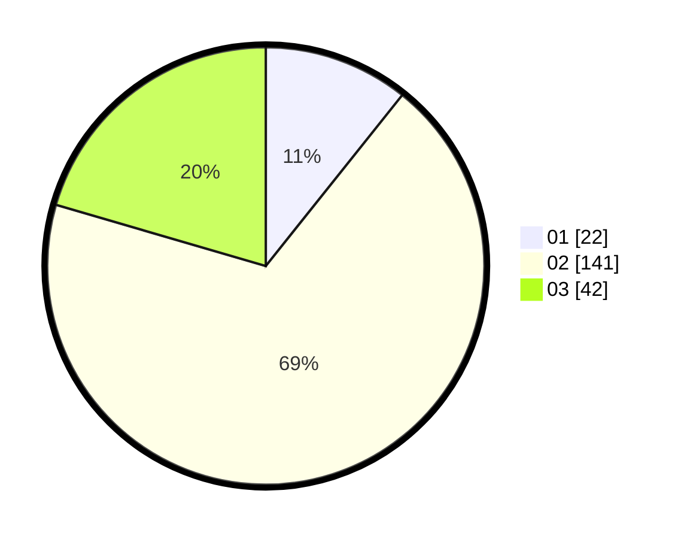

# Hasil

Hasil perolehan suara paslon dapat dilihat pada file paslon-01.txt, paslon-02.txt, dan paslon-03.txt.

Jika tidak ada, artinya data tersebut belum ada pada SIREKAP.

## Perolehan Suara

 * Paslon 01: **22**.
 * Paslon 02: **141**.
 * Paslon 03: **42**.

## Foto C Plano

https://sirekap-obj-formc.kpu.go.id/155d/pemilu/ppwp/31/73/01/10/05/3173011005140-20240216-014953--242d4af2-2de7-43fe-9098-d7fd49f6c975.jpg

https://sirekap-obj-formc.kpu.go.id/155d/pemilu/ppwp/31/73/01/10/05/3173011005140-20240214-141828--98ae0f8b-6b87-40b9-9dc9-469ffa641b06.jpg

https://sirekap-obj-formc.kpu.go.id/155d/pemilu/ppwp/31/73/01/10/05/3173011005140-20240216-014959--908c447e-9bad-4db2-a11a-b1b6884b50b1.jpg

## DATA PEMILIH TETAP

Jumlah pemilih dalam DPT: **269**.
 * L: **135**.
 * P: **134**.

## DATA PENGGUNA HAK PILIH

Jumlah pengguna hak pilih dalam DPT: **204**.
 * L: **101**.
 * P: **103**.

Jumlah pengguna hak pilih dalam DPTb: **0**.
 * L: **2**.
 * P: **0**.

Jumlah pengguna hak pilih dalam DPK: **0**.
 * L: **0**.
 * P: **0**.

Jumlah pengguna hak pilih: **206**.
 * L: **103**.
 * P: **103**.

## JUMLAH SUARA SAH DAN TIDAK SAH

JUMLAH SELURUH SUARA SAH: **205**.

JUMLAH SUARA TIDAK SAH: **1**.

JUMLAH SELURUH SUARA SAH DAN SUARA TIDAK SAH: **0**.
