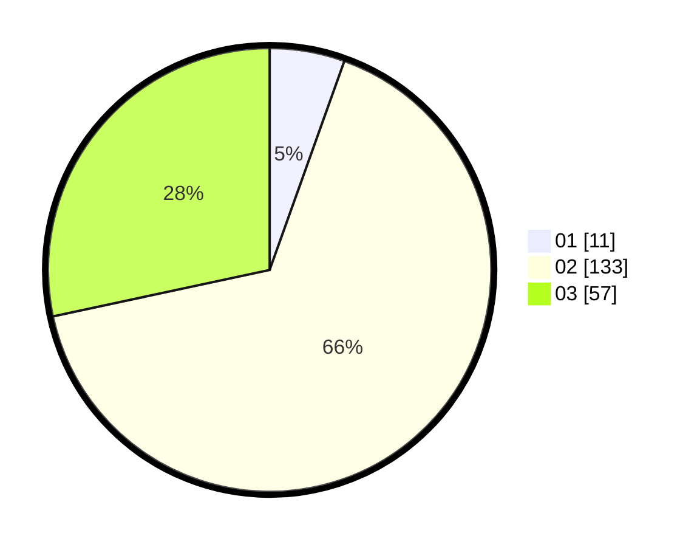

# Hasil

Hasil perolehan suara paslon dapat dilihat pada file paslon-01.txt, paslon-02.txt, dan paslon-03.txt.

Jika tidak ada, artinya data tersebut belum ada pada SIREKAP.

## Perolehan Suara

 * Paslon 01: **11**.
 * Paslon 02: **133**.
 * Paslon 03: **57**.

## Foto C Plano

https://sirekap-obj-formc.kpu.go.id/29a2/pemilu/ppwp/31/73/01/10/05/3173011005141-20240215-041139--9bc44ede-4769-45df-9bf5-26e9551520cf.jpg

https://sirekap-obj-formc.kpu.go.id/29a2/pemilu/ppwp/31/73/01/10/05/3173011005141-20240215-041212--9cd81b6f-185f-49dc-acf8-c9fab7eaabb7.jpg

https://sirekap-obj-formc.kpu.go.id/29a2/pemilu/ppwp/31/73/01/10/05/3173011005141-20240215-041226--093f7c01-6b69-472a-b159-59bbe1339fd1.jpg
