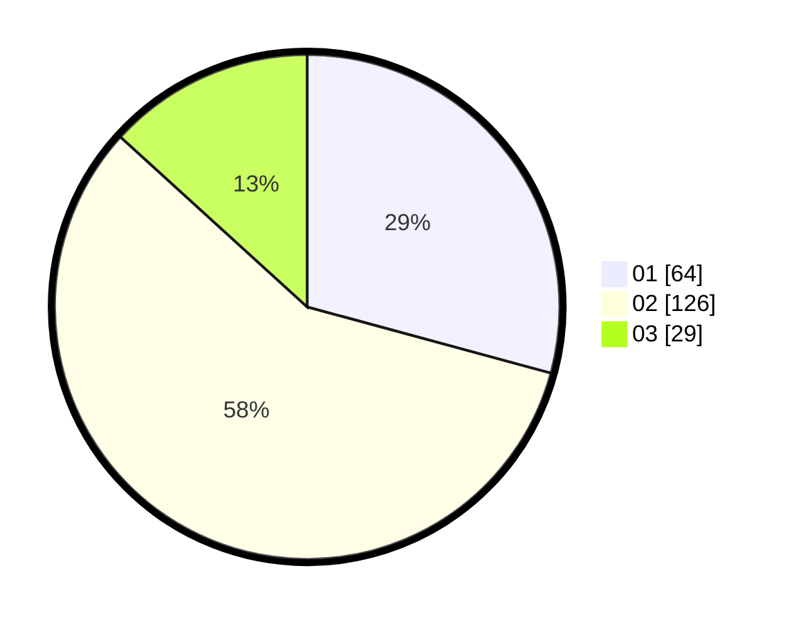

# Hasil

Hasil perolehan suara paslon dapat dilihat pada file paslon-01.txt, paslon-02.txt, dan paslon-03.txt.

Jika tidak ada, artinya data tersebut belum ada pada SIREKAP.

## Perolehan Suara

 * Paslon 01: **64**.
 * Paslon 02: **126**.
 * Paslon 03: **29**.

## Foto C Plano

https://sirekap-obj-formc.kpu.go.id/13e3/pemilu/ppwp/31/73/01/10/05/3173011005151-20240216-035928--dbe33596-b518-4836-a8ce-09e1c9c7fac1.jpg

https://sirekap-obj-formc.kpu.go.id/13e3/pemilu/ppwp/31/73/01/10/05/3173011005151-20240216-040532--70e75ff0-d7cb-4c68-ae37-71cd8fdee9ec.jpg

https://sirekap-obj-formc.kpu.go.id/13e3/pemilu/ppwp/31/73/01/10/05/3173011005151-20240216-035935--d9d32690-998a-487b-9e55-0e8606455fea.jpg

## DATA PEMILIH TETAP

Jumlah pemilih dalam DPT: **276**.
 * L: **138**.
 * P: **138**.

## DATA PENGGUNA HAK PILIH

Jumlah pengguna hak pilih dalam DPT: **220**.
 * L: **110**.
 * P: **110**.

Jumlah pengguna hak pilih dalam DPTb: **3**.
 * L: **1**.
 * P: **2**.

Jumlah pengguna hak pilih dalam DPK: **0**.
 * L: **0**.
 * P: **0**.

Jumlah pengguna hak pilih: **223**.
 * L: **111**.
 * P: **112**.

## JUMLAH SUARA SAH DAN TIDAK SAH

JUMLAH SELURUH SUARA SAH: **219**.

JUMLAH SUARA TIDAK SAH: **4**.

JUMLAH SELURUH SUARA SAH DAN SUARA TIDAK SAH: **223**.
