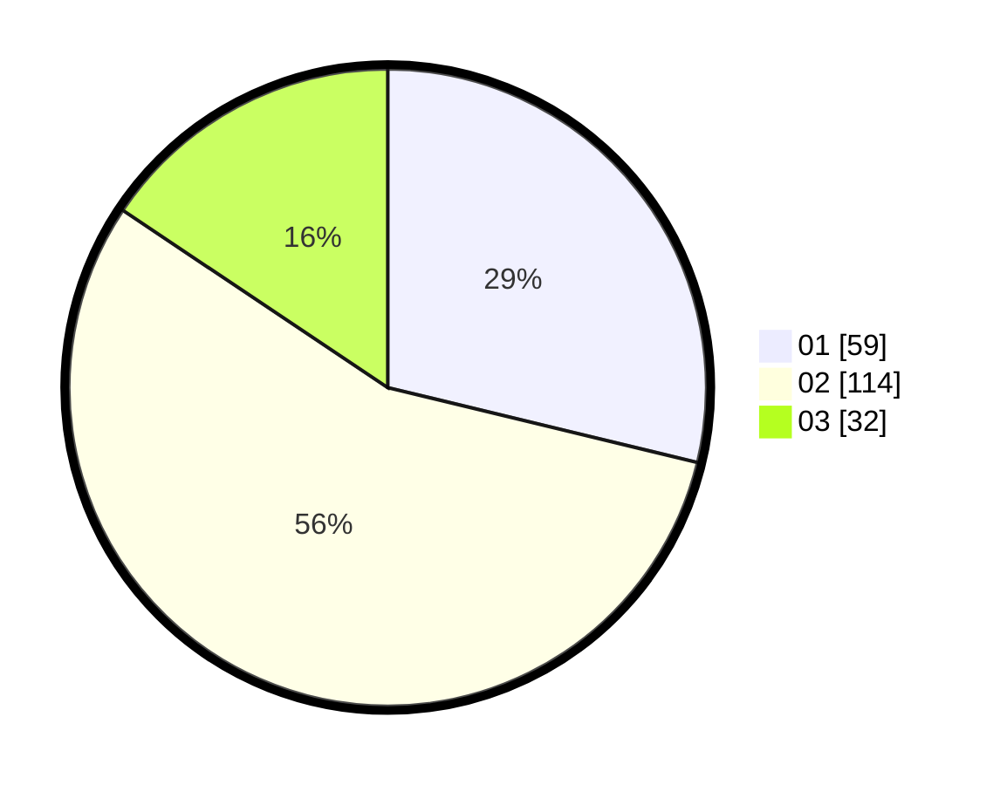

# Hasil

Hasil perolehan suara paslon dapat dilihat pada file paslon-01.txt, paslon-02.txt, dan paslon-03.txt.

Jika tidak ada, artinya data tersebut belum ada pada SIREKAP.

## Perolehan Suara

 * Paslon 01: **59**.
 * Paslon 02: **114**.
 * Paslon 03: **32**.

## Foto C Plano

https://sirekap-obj-formc.kpu.go.id/1637/pemilu/ppwp/31/73/01/10/05/3173011005153-20240214-224905--0fad1093-e1ce-4ff7-89bb-caaff66940ee.jpg

https://sirekap-obj-formc.kpu.go.id/1637/pemilu/ppwp/31/73/01/10/05/3173011005153-20240214-212231--c5782923-75d7-4b5d-b09c-36ab278371ac.jpg

https://sirekap-obj-formc.kpu.go.id/1637/pemilu/ppwp/31/73/01/10/05/3173011005153-20240214-212335--5e312f3f-568d-412d-84f9-8b728e907b33.jpg
