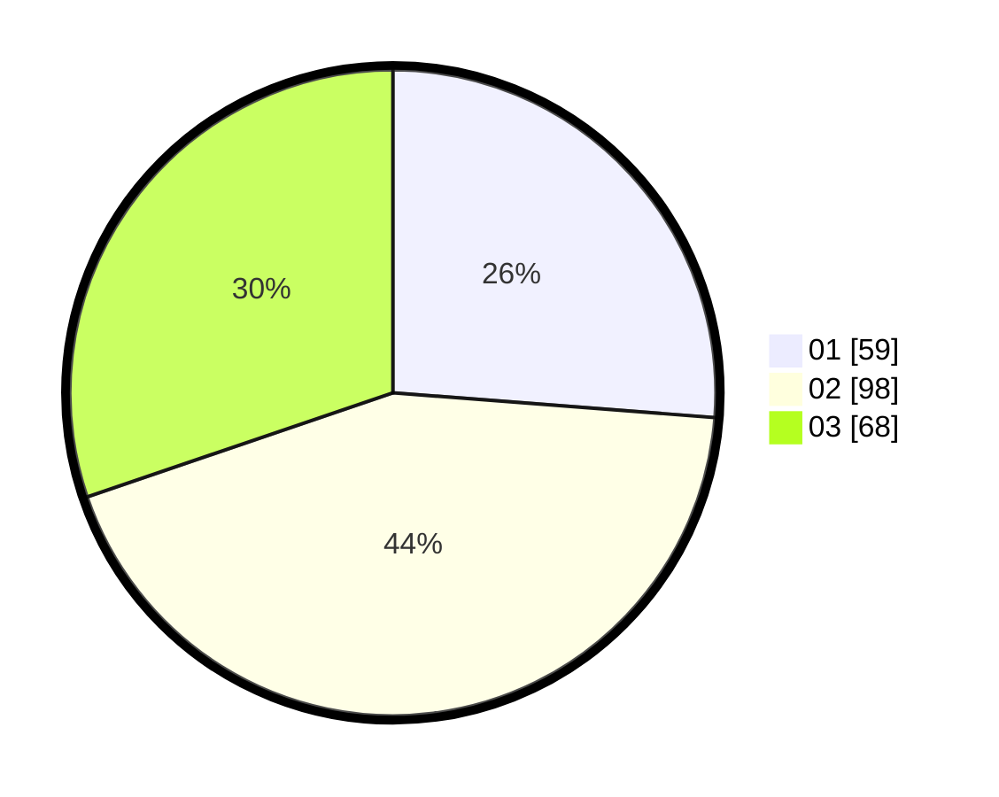

# Hasil

Hasil perolehan suara paslon dapat dilihat pada file paslon-01.txt, paslon-02.txt, dan paslon-03.txt.

Jika tidak ada, artinya data tersebut belum ada pada SIREKAP.

## Perolehan Suara

 * Paslon 01: **59**.
 * Paslon 02: **98**.
 * Paslon 03: **68**.

## Foto C Plano

https://sirekap-obj-formc.kpu.go.id/4e3a/pemilu/ppwp/31/73/01/10/05/3173011005157-20240215-022332--c67a733a-5257-42fc-8c20-f0d384136f66.jpg

https://sirekap-obj-formc.kpu.go.id/4e3a/pemilu/ppwp/31/73/01/10/05/3173011005157-20240215-022354--1df64715-f76e-407e-bd7b-e5751ab33335.jpg

https://sirekap-obj-formc.kpu.go.id/4e3a/pemilu/ppwp/31/73/01/10/05/3173011005157-20240215-022342--18ab3218-ac2d-4b67-8ab9-c5fdcf93b81c.jpg

## DATA PEMILIH TETAP

Jumlah pemilih dalam DPT: **279**.
 * L: **127**.
 * P: **152**.

## DATA PENGGUNA HAK PILIH

Jumlah pengguna hak pilih dalam DPT: **225**.
 * L: **105**.
 * P: **120**.

Jumlah pengguna hak pilih dalam DPTb: **0**.
 * L: **0**.
 * P: **0**.

Jumlah pengguna hak pilih dalam DPK: **1**.
 * L: **0**.
 * P: **1**.

Jumlah pengguna hak pilih: **226**.
 * L: **105**.
 * P: **121**.

## JUMLAH SUARA SAH DAN TIDAK SAH

JUMLAH SELURUH SUARA SAH: **225**.

JUMLAH SUARA TIDAK SAH: **1**.

JUMLAH SELURUH SUARA SAH DAN SUARA TIDAK SAH: **226**.
