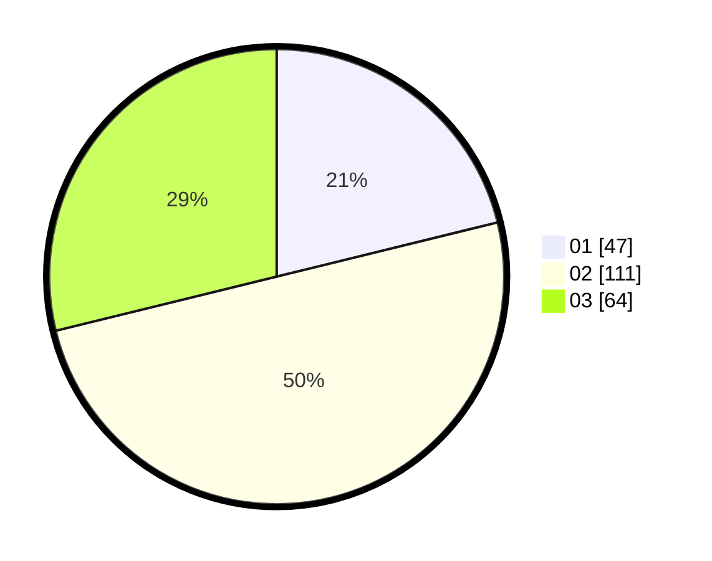

# Hasil

Hasil perolehan suara paslon dapat dilihat pada file paslon-01.txt, paslon-02.txt, dan paslon-03.txt.

Jika tidak ada, artinya data tersebut belum ada pada SIREKAP.

## Perolehan Suara

 * Paslon 01: **47**.
 * Paslon 02: **111**.
 * Paslon 03: **64**.

## Foto C Plano

https://sirekap-obj-formc.kpu.go.id/079f/pemilu/ppwp/31/73/01/10/05/3173011005160-20240215-002946--72b4b5bc-7720-4acb-a404-832944c3b142.jpg

https://sirekap-obj-formc.kpu.go.id/079f/pemilu/ppwp/31/73/01/10/05/3173011005160-20240214-225053--2d84a00b-f821-4151-af5c-ba4d253a79a5.jpg

https://sirekap-obj-formc.kpu.go.id/079f/pemilu/ppwp/31/73/01/10/05/3173011005160-20240214-225234--693656f8-89b7-4b4f-a6b9-36ded014b5c6.jpg

## DATA PEMILIH TETAP

Jumlah pemilih dalam DPT: **276**.
 * L: **132**.
 * P: **138**.

## DATA PENGGUNA HAK PILIH

Jumlah pengguna hak pilih dalam DPT: **222**.
 * L: **113**.
 * P: **109**.

Jumlah pengguna hak pilih dalam DPTb: **0**.
 * L: **0**.
 * P: **0**.

Jumlah pengguna hak pilih dalam DPK: **2**.
 * L: **2**.
 * P: **0**.

Jumlah pengguna hak pilih: **224**.
 * L: **115**.
 * P: **109**.

## JUMLAH SUARA SAH DAN TIDAK SAH

JUMLAH SELURUH SUARA SAH: **222**.

JUMLAH SUARA TIDAK SAH: **2**.

JUMLAH SELURUH SUARA SAH DAN SUARA TIDAK SAH: **224**.
