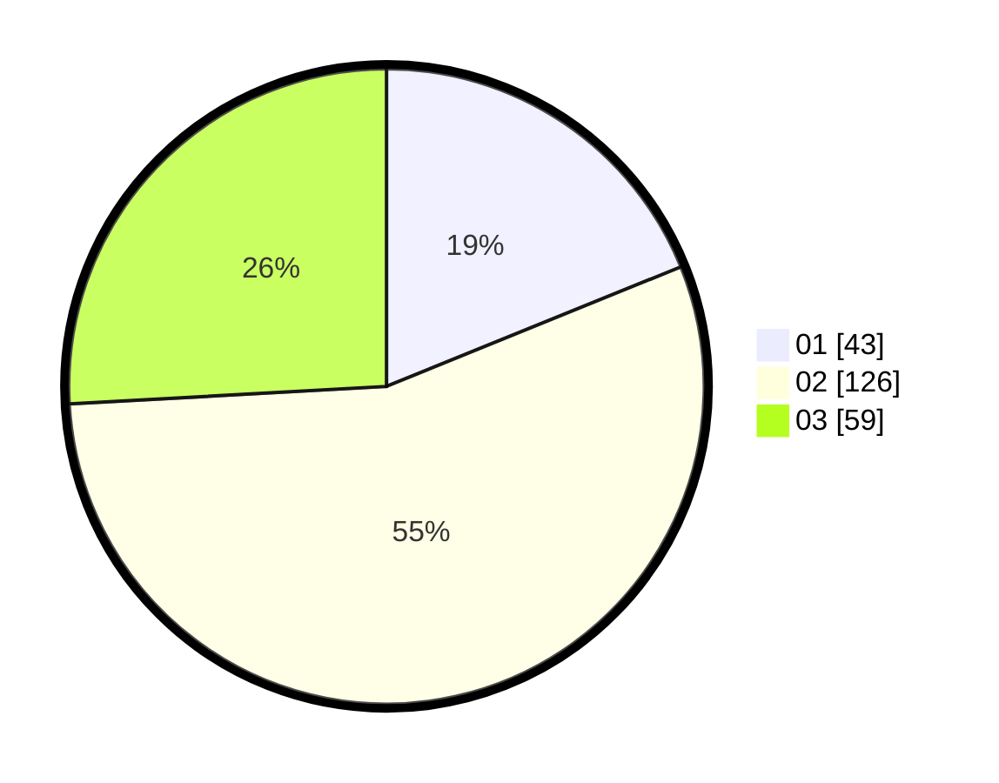

# Hasil

Hasil perolehan suara paslon dapat dilihat pada file paslon-01.txt, paslon-02.txt, dan paslon-03.txt.

Jika tidak ada, artinya data tersebut belum ada pada SIREKAP.

## Perolehan Suara

 * Paslon 01: **43**.
 * Paslon 02: **126**.
 * Paslon 03: **59**.

## Foto C Plano

https://sirekap-obj-formc.kpu.go.id/1118/pemilu/ppwp/31/73/01/10/05/3173011005161-20240214-214711--28de36c0-daf7-4a69-bfbd-190c6b068982.jpg

https://sirekap-obj-formc.kpu.go.id/1118/pemilu/ppwp/31/73/01/10/05/3173011005161-20240214-191931--1d0604ce-6993-4b69-b57f-b93bd47981d5.jpg

https://sirekap-obj-formc.kpu.go.id/1118/pemilu/ppwp/31/73/01/10/05/3173011005161-20240214-214952--46464388-534e-4b5f-bcf4-0e67f5b4e469.jpg

## DATA PEMILIH TETAP

Jumlah pemilih dalam DPT: **283**.
 * L: **137**.
 * P: **146**.

## DATA PENGGUNA HAK PILIH

Jumlah pengguna hak pilih dalam DPT: **224**.
 * L: **112**.
 * P: **112**.

Jumlah pengguna hak pilih dalam DPTb: **6**.
 * L: **1**.
 * P: **5**.

Jumlah pengguna hak pilih dalam DPK: **1**.
 * L: **0**.
 * P: **1**.

Jumlah pengguna hak pilih: **231**.
 * L: **113**.
 * P: **118**.

## JUMLAH SUARA SAH DAN TIDAK SAH

JUMLAH SELURUH SUARA SAH: **228**.

JUMLAH SUARA TIDAK SAH: **3**.

JUMLAH SELURUH SUARA SAH DAN SUARA TIDAK SAH: **231**.
