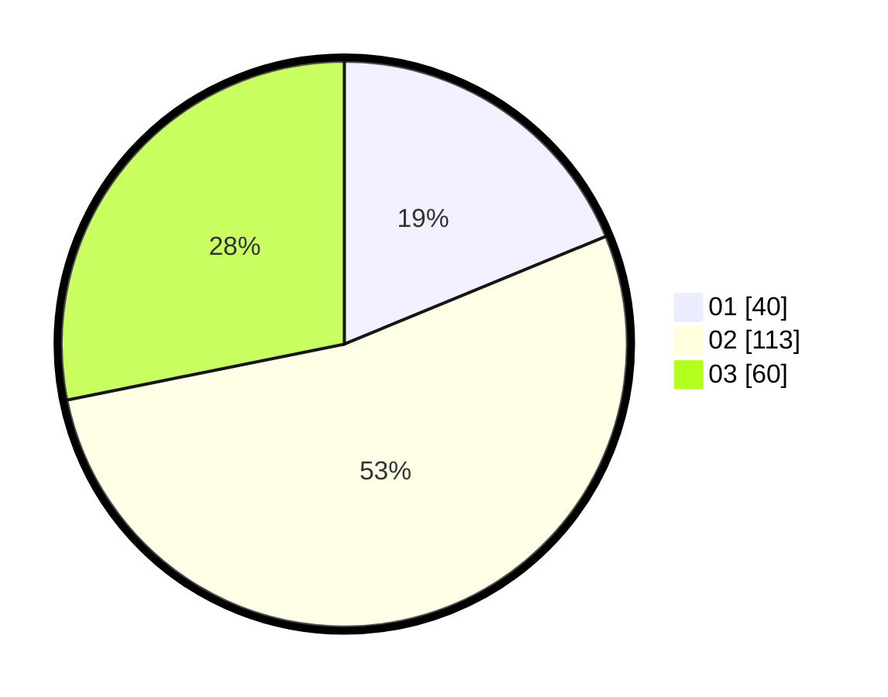

# Hasil

Hasil perolehan suara paslon dapat dilihat pada file paslon-01.txt, paslon-02.txt, dan paslon-03.txt.

Jika tidak ada, artinya data tersebut belum ada pada SIREKAP.

## Perolehan Suara

 * Paslon 01: **40**.
 * Paslon 02: **113**.
 * Paslon 03: **60**.

## Foto C Plano

https://sirekap-obj-formc.kpu.go.id/04a9/pemilu/ppwp/31/73/01/10/05/3173011005164-20240215-004500--a20dd740-b0ac-40a9-95e0-8705b576fc5a.jpg

https://sirekap-obj-formc.kpu.go.id/04a9/pemilu/ppwp/31/73/01/10/05/3173011005164-20240214-214932--72a7ddd6-fb8f-4c85-9ef6-86bdd7e4c084.jpg

https://sirekap-obj-formc.kpu.go.id/04a9/pemilu/ppwp/31/73/01/10/05/3173011005164-20240214-214953--60fcd546-9e1c-4331-8032-8d4acca2a8e7.jpg
