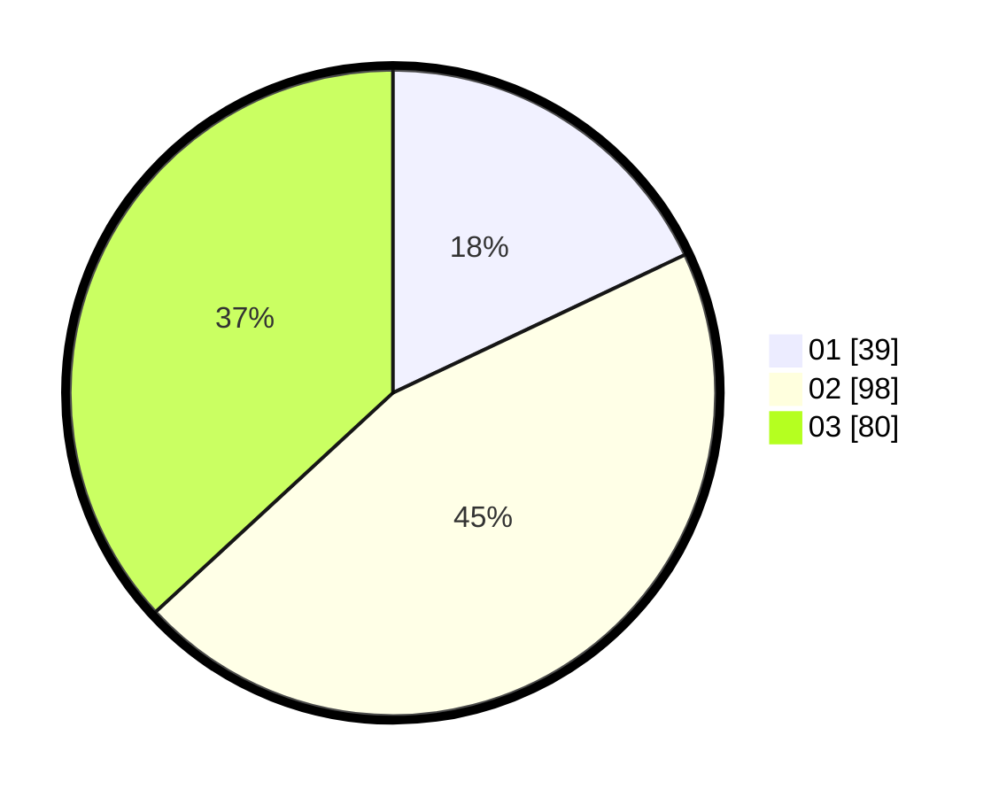

# Hasil

Hasil perolehan suara paslon dapat dilihat pada file paslon-01.txt, paslon-02.txt, dan paslon-03.txt.

Jika tidak ada, artinya data tersebut belum ada pada SIREKAP.

## Perolehan Suara

 * Paslon 01: **39**.
 * Paslon 02: **98**.
 * Paslon 03: **80**.

## Foto C Plano

https://sirekap-obj-formc.kpu.go.id/f5d0/pemilu/ppwp/31/73/01/10/05/3173011005167-20240214-211020--bcf4daad-bd7f-48d6-8daa-bc1905821281.jpg

https://sirekap-obj-formc.kpu.go.id/f5d0/pemilu/ppwp/31/73/01/10/05/3173011005167-20240214-223841--8746f364-6e09-42b1-94c1-3af34f39ccc3.jpg

https://sirekap-obj-formc.kpu.go.id/f5d0/pemilu/ppwp/31/73/01/10/05/3173011005167-20240214-223956--c65bd9e3-4c24-4491-8c28-5832ced05650.jpg
