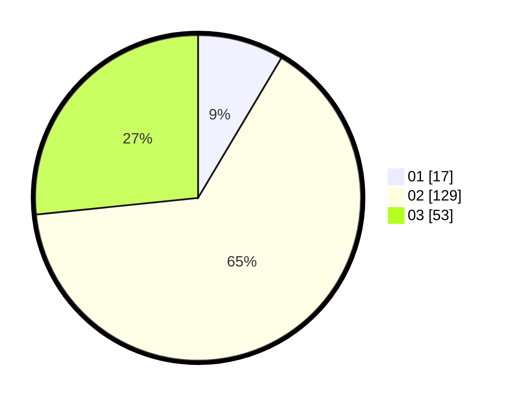

# Hasil

Hasil perolehan suara paslon dapat dilihat pada file paslon-01.txt, paslon-02.txt, dan paslon-03.txt.

Jika tidak ada, artinya data tersebut belum ada pada SIREKAP.

## Perolehan Suara

 * Paslon 01: **17**.
 * Paslon 02: **129**.
 * Paslon 03: **53**.

## Foto C Plano

https://sirekap-obj-formc.kpu.go.id/5474/pemilu/ppwp/31/73/01/10/05/3173011005169-20240215-020442--0055cca5-f58b-40b3-b096-be70f008fb26.jpg

https://sirekap-obj-formc.kpu.go.id/5474/pemilu/ppwp/31/73/01/10/05/3173011005169-20240215-020501--2dc12232-8b45-486e-af8c-5c0cb434141d.jpg

https://sirekap-obj-formc.kpu.go.id/5474/pemilu/ppwp/31/73/01/10/05/3173011005169-20240215-020519--f001e52f-ea90-4a7f-b971-84c033432928.jpg

## DATA PEMILIH TETAP

Jumlah pemilih dalam DPT: **258**.
 * L: **128**.
 * P: **140**.

## DATA PENGGUNA HAK PILIH

Jumlah pengguna hak pilih dalam DPT: **194**.
 * L: **84**.
 * P: **110**.

Jumlah pengguna hak pilih dalam DPTb: **2**.
 * L: **7**.
 * P: **1**.

Jumlah pengguna hak pilih dalam DPK: **4**.
 * L: **1**.
 * P: **3**.

Jumlah pengguna hak pilih: **200**.
 * L: **86**.
 * P: **114**.

## JUMLAH SUARA SAH DAN TIDAK SAH

JUMLAH SELURUH SUARA SAH: **199**.

JUMLAH SUARA TIDAK SAH: **1**.

JUMLAH SELURUH SUARA SAH DAN SUARA TIDAK SAH: **200**.
