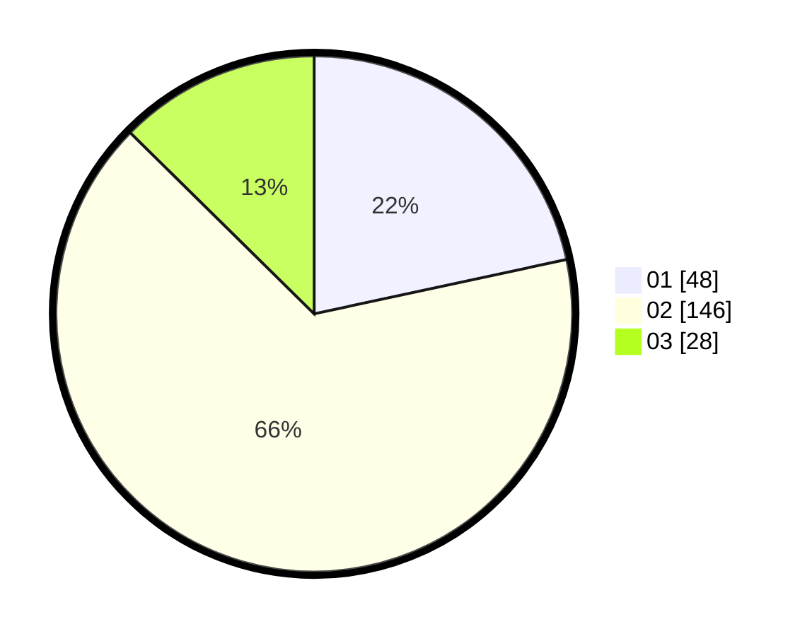

# Hasil

Hasil perolehan suara paslon dapat dilihat pada file paslon-01.txt, paslon-02.txt, dan paslon-03.txt.

Jika tidak ada, artinya data tersebut belum ada pada SIREKAP.

## Perolehan Suara

 * Paslon 01: **48**.
 * Paslon 02: **146**.
 * Paslon 03: **28**.

## Foto C Plano

https://sirekap-obj-formc.kpu.go.id/d0bc/pemilu/ppwp/31/73/01/10/05/3173011005177-20240214-234227--3e18cf11-32ad-4d12-854d-916d627e56d7.jpg

https://sirekap-obj-formc.kpu.go.id/d0bc/pemilu/ppwp/31/73/01/10/05/3173011005177-20240214-234349--ba8addbd-9051-4510-9abc-6cc6ff4042dd.jpg

https://sirekap-obj-formc.kpu.go.id/d0bc/pemilu/ppwp/31/73/01/10/05/3173011005177-20240214-234542--c5831fa6-f942-4917-b86e-7ef34fede831.jpg

## DATA PEMILIH TETAP

Jumlah pemilih dalam DPT: **285**.
 * L: **146**.
 * P: **139**.

## DATA PENGGUNA HAK PILIH

Jumlah pengguna hak pilih dalam DPT: **223**.
 * L: **113**.
 * P: **110**.

Jumlah pengguna hak pilih dalam DPTb: **1**.
 * L: **1**.
 * P: **0**.

Jumlah pengguna hak pilih dalam DPK: **1**.
 * L: **1**.
 * P: **0**.

Jumlah pengguna hak pilih: **225**.
 * L: **115**.
 * P: **110**.

## JUMLAH SUARA SAH DAN TIDAK SAH

JUMLAH SELURUH SUARA SAH: **222**.

JUMLAH SUARA TIDAK SAH: **3**.

JUMLAH SELURUH SUARA SAH DAN SUARA TIDAK SAH: **225**.
