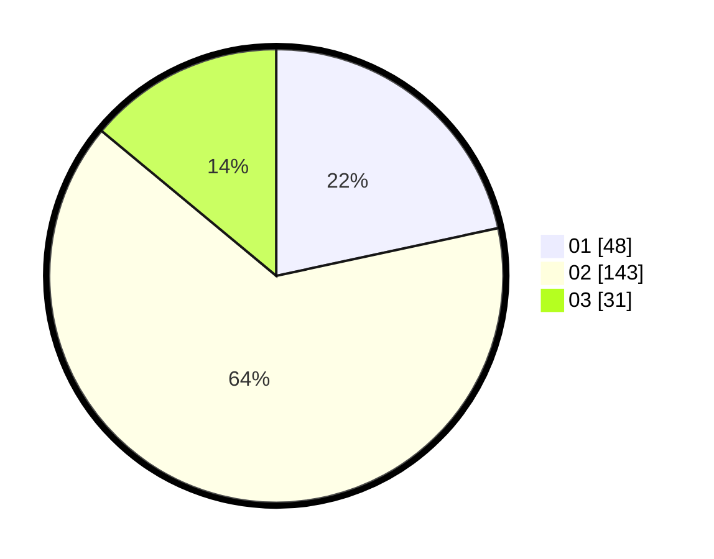

# Hasil

Hasil perolehan suara paslon dapat dilihat pada file paslon-01.txt, paslon-02.txt, dan paslon-03.txt.

Jika tidak ada, artinya data tersebut belum ada pada SIREKAP.

## Perolehan Suara

 * Paslon 01: **48**.
 * Paslon 02: **143**.
 * Paslon 03: **31**.

## Foto C Plano

https://sirekap-obj-formc.kpu.go.id/4f84/pemilu/ppwp/31/73/01/10/05/3173011005179-20240214-221635--c85d57c5-0a72-457c-a71a-c863215a3be0.jpg

https://sirekap-obj-formc.kpu.go.id/4f84/pemilu/ppwp/31/73/01/10/05/3173011005179-20240214-221724--ff9c9981-b6fb-486d-bf96-ce8a2221a547.jpg

https://sirekap-obj-formc.kpu.go.id/4f84/pemilu/ppwp/31/73/01/10/05/3173011005179-20240214-155431--73e50eb3-a26a-4592-ae3b-690332eaad0d.jpg
