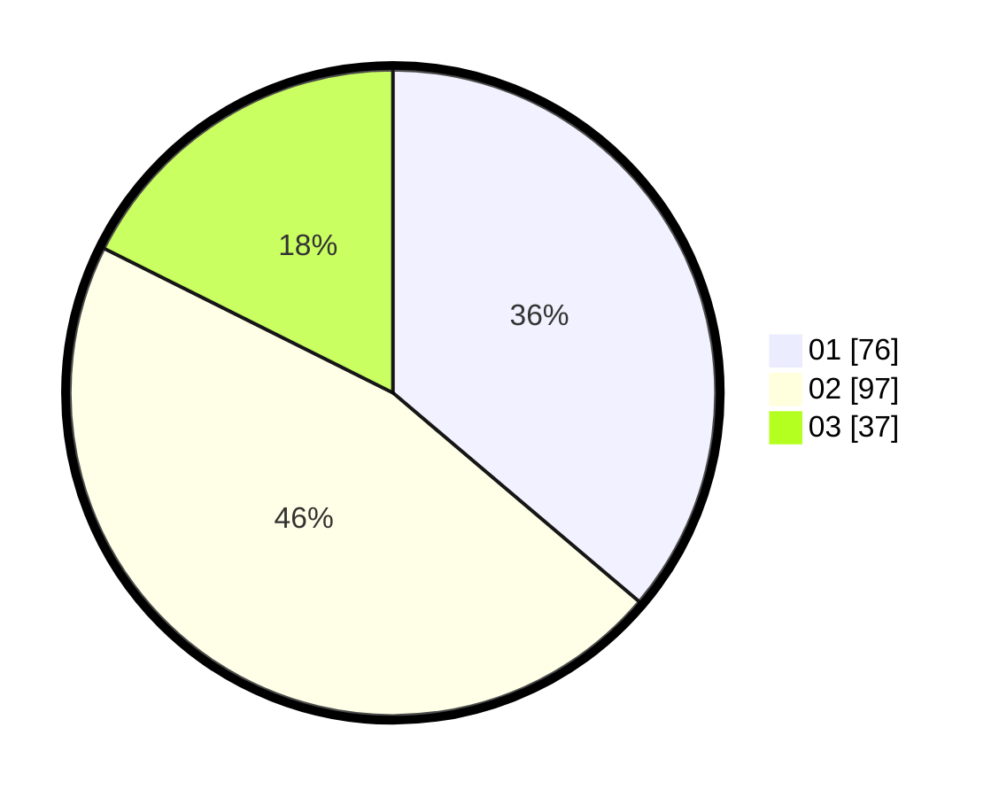

# Hasil

Hasil perolehan suara paslon dapat dilihat pada file paslon-01.txt, paslon-02.txt, dan paslon-03.txt.

Jika tidak ada, artinya data tersebut belum ada pada SIREKAP.

## Perolehan Suara

 * Paslon 01: **76**.
 * Paslon 02: **97**.
 * Paslon 03: **37**.

## Foto C Plano

https://sirekap-obj-formc.kpu.go.id/83e3/pemilu/ppwp/31/73/01/10/05/3173011005183-20240215-004317--7bdbf912-72c5-46ba-a68e-d70e8fa4a789.jpg

https://sirekap-obj-formc.kpu.go.id/83e3/pemilu/ppwp/31/73/01/10/05/3173011005183-20240215-004023--5ba88ae2-1152-4c46-8167-efa92beab2a2.jpg

https://sirekap-obj-formc.kpu.go.id/83e3/pemilu/ppwp/31/73/01/10/05/3173011005183-20240215-003919--cb118da5-17ad-4e4e-b8e8-ec5c0e91e2d9.jpg
