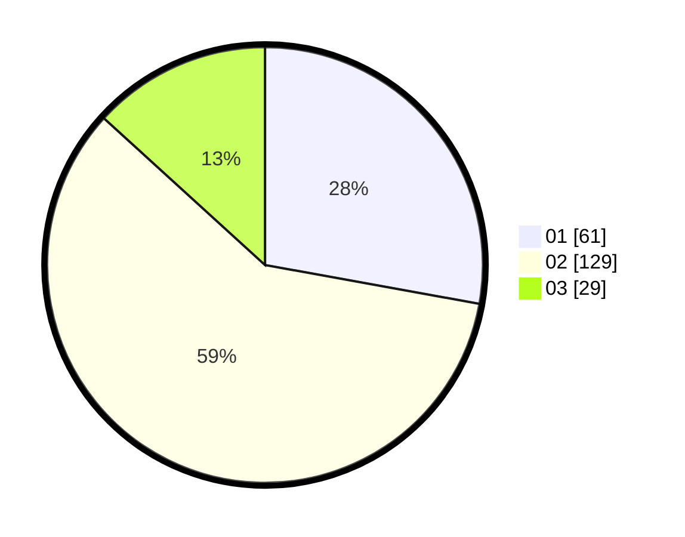

# Hasil

Hasil perolehan suara paslon dapat dilihat pada file paslon-01.txt, paslon-02.txt, dan paslon-03.txt.

Jika tidak ada, artinya data tersebut belum ada pada SIREKAP.

## Perolehan Suara

 * Paslon 01: **61**.
 * Paslon 02: **129**.
 * Paslon 03: **29**.

## Foto C Plano

https://sirekap-obj-formc.kpu.go.id/1a2d/pemilu/ppwp/31/73/01/10/05/3173011005184-20240214-200809--1a27a475-1539-4a36-ab08-b13c58f5aad0.jpg

https://sirekap-obj-formc.kpu.go.id/1a2d/pemilu/ppwp/31/73/01/10/05/3173011005184-20240214-200822--69662ef5-2ffc-4cb7-bfc2-6593e0a69f77.jpg

https://sirekap-obj-formc.kpu.go.id/1a2d/pemilu/ppwp/31/73/01/10/05/3173011005184-20240214-200828--02ecb2fa-26f8-45f3-a1b0-0253f8a23748.jpg

## DATA PEMILIH TETAP

Jumlah pemilih dalam DPT: **288**.
 * L: **137**.
 * P: **151**.

## DATA PENGGUNA HAK PILIH

Jumlah pengguna hak pilih dalam DPT: **221**.
 * L: **99**.
 * P: **122**.

Jumlah pengguna hak pilih dalam DPTb: **0**.
 * L: **0**.
 * P: **0**.

Jumlah pengguna hak pilih dalam DPK: **4**.
 * L: **2**.
 * P: **2**.

Jumlah pengguna hak pilih: **225**.
 * L: **101**.
 * P: **124**.

## JUMLAH SUARA SAH DAN TIDAK SAH

JUMLAH SELURUH SUARA SAH: **219**.

JUMLAH SUARA TIDAK SAH: **6**.

JUMLAH SELURUH SUARA SAH DAN SUARA TIDAK SAH: **225**.
