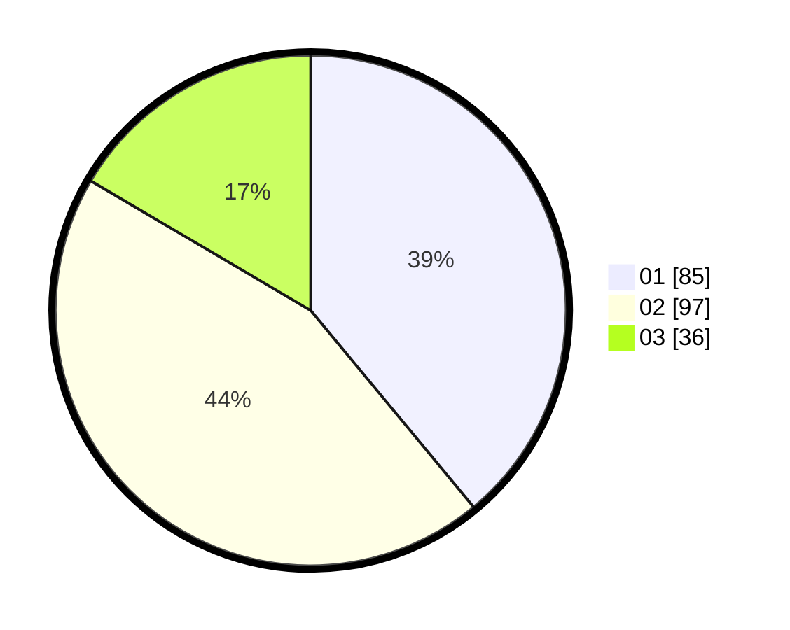

# Hasil

Hasil perolehan suara paslon dapat dilihat pada file paslon-01.txt, paslon-02.txt, dan paslon-03.txt.

Jika tidak ada, artinya data tersebut belum ada pada SIREKAP.

## Perolehan Suara

 * Paslon 01: **85**.
 * Paslon 02: **97**.
 * Paslon 03: **36**.

## Foto C Plano

https://sirekap-obj-formc.kpu.go.id/e07f/pemilu/ppwp/31/73/01/10/05/3173011005186-20240214-221559--7e1a854c-a7a2-4ecf-82ab-fb353872dedf.jpg

https://sirekap-obj-formc.kpu.go.id/e07f/pemilu/ppwp/31/73/01/10/05/3173011005186-20240214-201535--2862fb8a-d1b0-4e2e-90b1-5475094dcfcd.jpg

https://sirekap-obj-formc.kpu.go.id/e07f/pemilu/ppwp/31/73/01/10/05/3173011005186-20240214-200202--490c519e-d727-4fc3-8082-900b8b3d3d94.jpg
