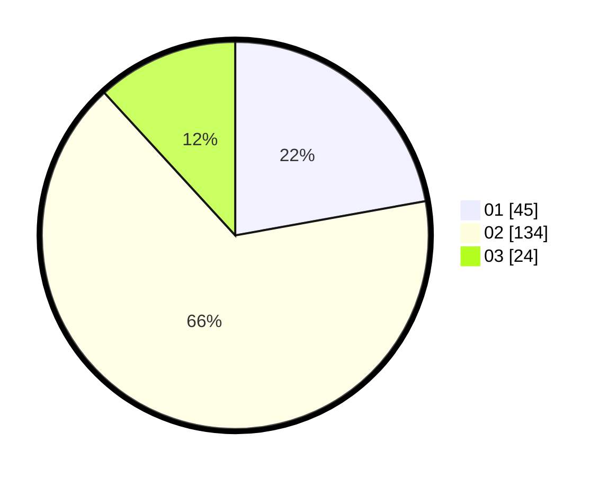

# Hasil

Hasil perolehan suara paslon dapat dilihat pada file paslon-01.txt, paslon-02.txt, dan paslon-03.txt.

Jika tidak ada, artinya data tersebut belum ada pada SIREKAP.

## Perolehan Suara

 * Paslon 01: **45**.
 * Paslon 02: **134**.
 * Paslon 03: **24**.

## Foto C Plano

https://sirekap-obj-formc.kpu.go.id/3409/pemilu/ppwp/31/73/01/10/05/3173011005187-20240214-222232--1b5dcbdb-882e-403a-9969-1844878c3023.jpg

https://sirekap-obj-formc.kpu.go.id/3409/pemilu/ppwp/31/73/01/10/05/3173011005187-20240214-222336--f6d88114-9ae2-4225-a006-33f957bfaf8d.jpg

https://sirekap-obj-formc.kpu.go.id/3409/pemilu/ppwp/31/73/01/10/05/3173011005187-20240214-222518--cf0ad296-e9ff-4d14-bf8f-351b60c01d95.jpg
