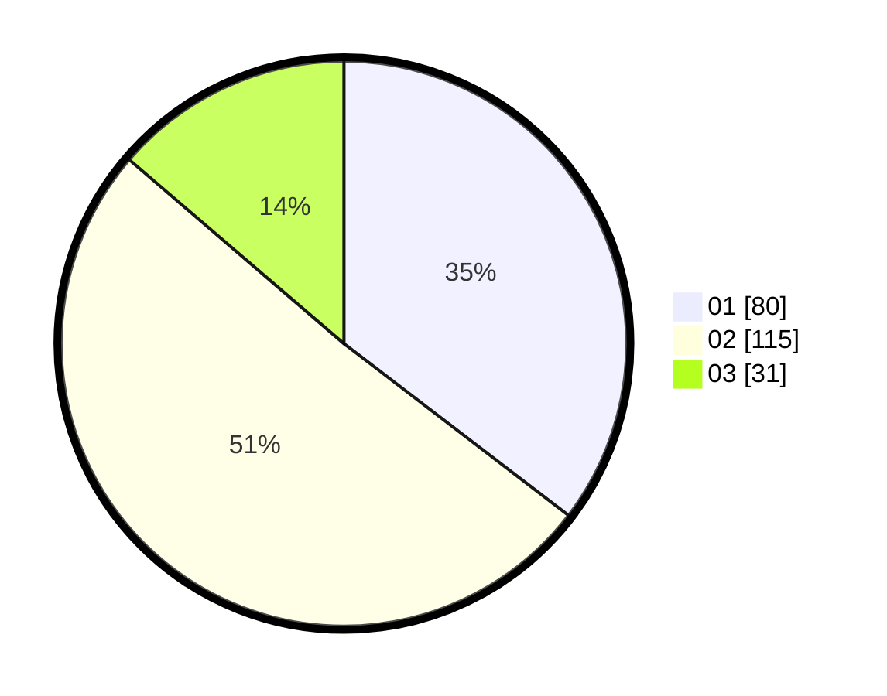

# Hasil

Hasil perolehan suara paslon dapat dilihat pada file paslon-01.txt, paslon-02.txt, dan paslon-03.txt.

Jika tidak ada, artinya data tersebut belum ada pada SIREKAP.

## Perolehan Suara

 * Paslon 01: **80**.
 * Paslon 02: **115**.
 * Paslon 03: **31**.

## Foto C Plano

https://sirekap-obj-formc.kpu.go.id/0153/pemilu/ppwp/31/73/01/10/05/3173011005193-20240216-134737--ac77f358-bf28-418c-acaa-94c371907e91.jpg

https://sirekap-obj-formc.kpu.go.id/0153/pemilu/ppwp/31/73/01/10/05/3173011005193-20240216-134738--8d32e439-50f4-4fbe-871d-fd43eabda25c.jpg

https://sirekap-obj-formc.kpu.go.id/0153/pemilu/ppwp/31/73/01/10/05/3173011005193-20240216-134737--ec26d58a-7478-4be8-ba04-98879c9b51e6.jpg

## DATA PEMILIH TETAP

Jumlah pemilih dalam DPT: **299**.
 * L: **155**.
 * P: **144**.

## DATA PENGGUNA HAK PILIH

Jumlah pengguna hak pilih dalam DPT: **225**.
 * L: **118**.
 * P: **107**.

Jumlah pengguna hak pilih dalam DPTb: **1**.
 * L: **0**.
 * P: **1**.

Jumlah pengguna hak pilih dalam DPK: **1**.
 * L: **0**.
 * P: **1**.

Jumlah pengguna hak pilih: **227**.
 * L: **118**.
 * P: **109**.

## JUMLAH SUARA SAH DAN TIDAK SAH

JUMLAH SELURUH SUARA SAH: **226**.

JUMLAH SUARA TIDAK SAH: **1**.

JUMLAH SELURUH SUARA SAH DAN SUARA TIDAK SAH: **227**.
