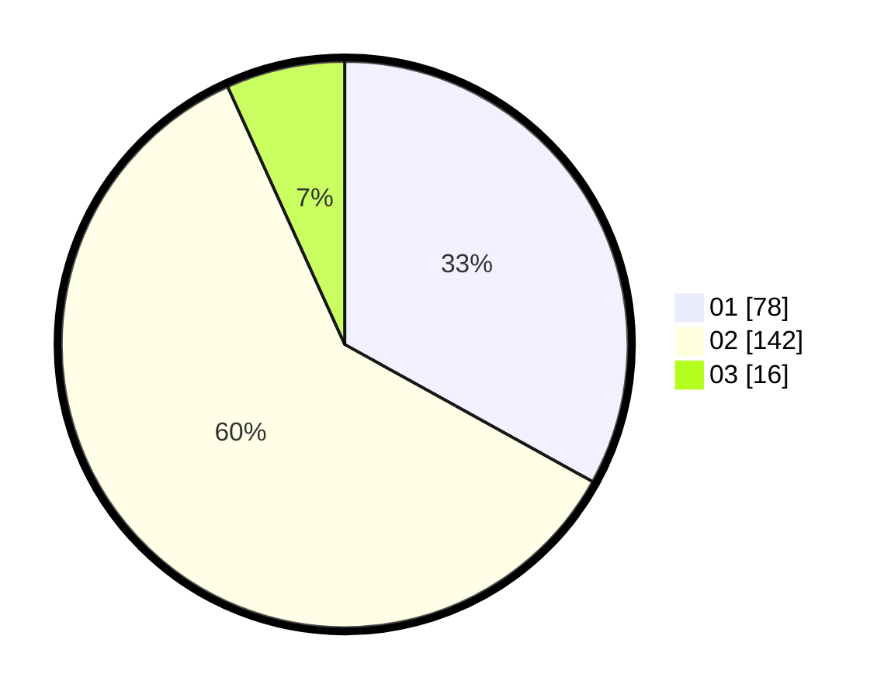

# Hasil

Hasil perolehan suara paslon dapat dilihat pada file paslon-01.txt, paslon-02.txt, dan paslon-03.txt.

Jika tidak ada, artinya data tersebut belum ada pada SIREKAP.

## Perolehan Suara

 * Paslon 01: **78**.
 * Paslon 02: **142**.
 * Paslon 03: **16**.

## Foto C Plano

https://sirekap-obj-formc.kpu.go.id/7d50/pemilu/ppwp/31/73/01/10/05/3173011005205-20240214-190616--fc5ea4d6-5aab-4fc5-a8c0-1d8f89cd4790.jpg

https://sirekap-obj-formc.kpu.go.id/7d50/pemilu/ppwp/31/73/01/10/05/3173011005205-20240214-194456--ae986cb8-3926-4e95-badb-a4f144c43c8a.jpg

https://sirekap-obj-formc.kpu.go.id/7d50/pemilu/ppwp/31/73/01/10/05/3173011005205-20240214-192644--57692d07-db57-4f8b-816e-792f167ceb6c.jpg

## DATA PEMILIH TETAP

Jumlah pemilih dalam DPT: **296**.
 * L: **152**.
 * P: **144**.

## DATA PENGGUNA HAK PILIH

Jumlah pengguna hak pilih dalam DPT: **242**.
 * L: **118**.
 * P: **124**.

Jumlah pengguna hak pilih dalam DPTb: **0**.
 * L: **0**.
 * P: **0**.

Jumlah pengguna hak pilih dalam DPK: **2**.
 * L: **1**.
 * P: **1**.

Jumlah pengguna hak pilih: **244**.
 * L: **119**.
 * P: **125**.

## JUMLAH SUARA SAH DAN TIDAK SAH

JUMLAH SELURUH SUARA SAH: **236**.

JUMLAH SUARA TIDAK SAH: **8**.

JUMLAH SELURUH SUARA SAH DAN SUARA TIDAK SAH: **244**.
