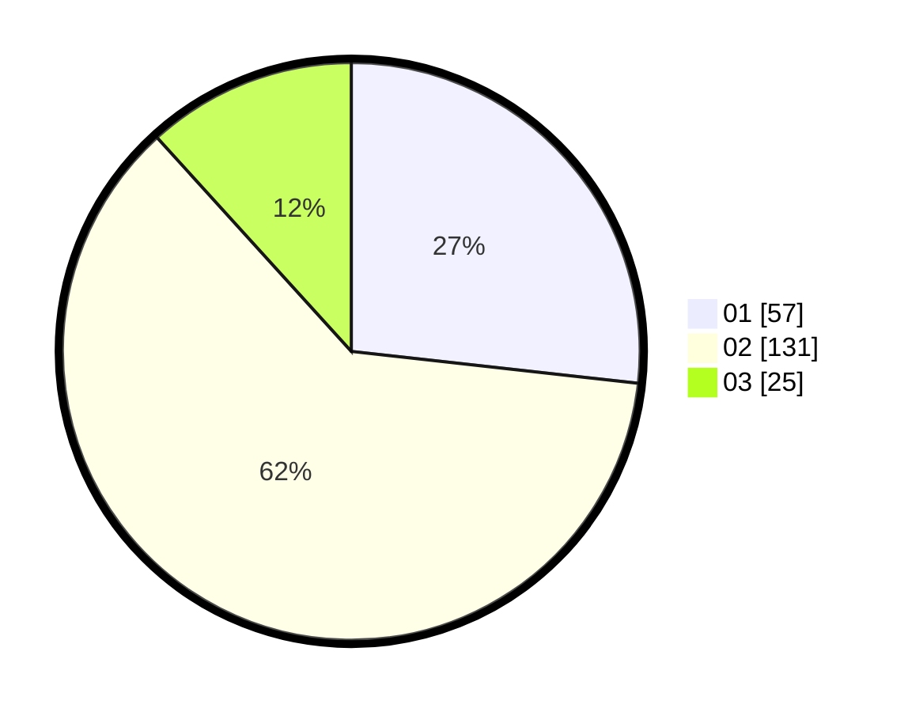

# Hasil

Hasil perolehan suara paslon dapat dilihat pada file paslon-01.txt, paslon-02.txt, dan paslon-03.txt.

Jika tidak ada, artinya data tersebut belum ada pada SIREKAP.

## Perolehan Suara

 * Paslon 01: **57**.
 * Paslon 02: **131**.
 * Paslon 03: **25**.

## Foto C Plano

https://sirekap-obj-formc.kpu.go.id/1f4d/pemilu/ppwp/31/73/01/10/05/3173011005207-20240216-113549--2e7ca513-2506-40e6-9a1d-73d729a6ef00.jpg

https://sirekap-obj-formc.kpu.go.id/1f4d/pemilu/ppwp/31/73/01/10/05/3173011005207-20240216-105414--53a0231b-2c95-4de2-be91-74800d128263.jpg

https://sirekap-obj-formc.kpu.go.id/1f4d/pemilu/ppwp/31/73/01/10/05/3173011005207-20240216-104304--f5d51f91-cf36-4d73-a18a-8f7e7ee2eb70.jpg

## DATA PEMILIH TETAP

Jumlah pemilih dalam DPT: **300**.
 * L: **150**.
 * P: **150**.

## DATA PENGGUNA HAK PILIH

Jumlah pengguna hak pilih dalam DPT: **212**.
 * L: **102**.
 * P: **110**.

Jumlah pengguna hak pilih dalam DPTb: **1**.
 * L: **1**.
 * P: **0**.

Jumlah pengguna hak pilih dalam DPK: **0**.
 * L: **0**.
 * P: **0**.

Jumlah pengguna hak pilih: **213**.
 * L: **103**.
 * P: **110**.

## JUMLAH SUARA SAH DAN TIDAK SAH

JUMLAH SELURUH SUARA SAH: **213**.

JUMLAH SUARA TIDAK SAH: **0**.

JUMLAH SELURUH SUARA SAH DAN SUARA TIDAK SAH: **213**.
