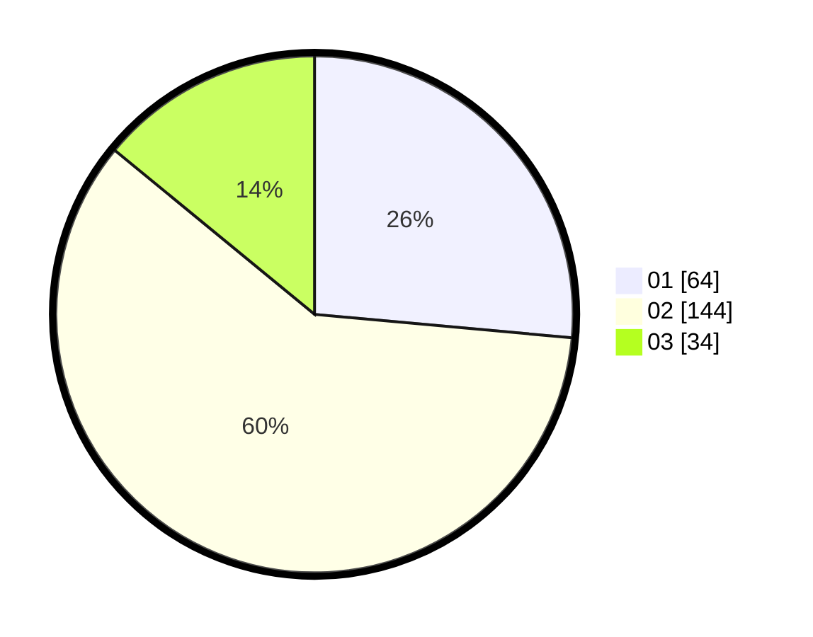

# Hasil

Hasil perolehan suara paslon dapat dilihat pada file paslon-01.txt, paslon-02.txt, dan paslon-03.txt.

Jika tidak ada, artinya data tersebut belum ada pada SIREKAP.

## Perolehan Suara

 * Paslon 01: **64**.
 * Paslon 02: **144**.
 * Paslon 03: **34**.

## Foto C Plano

https://sirekap-obj-formc.kpu.go.id/d002/pemilu/ppwp/31/73/01/10/05/3173011005208-20240216-134639--b98dcb63-19bb-4c2f-bc8f-7bb1fb769c44.jpg

https://sirekap-obj-formc.kpu.go.id/d002/pemilu/ppwp/31/73/01/10/05/3173011005208-20240216-134641--49640347-34f4-480f-a3d1-ff6b55f03fc5.jpg

https://sirekap-obj-formc.kpu.go.id/d002/pemilu/ppwp/31/73/01/10/05/3173011005208-20240216-134640--c7777492-58aa-4623-b3db-5c67c04bdff1.jpg

## DATA PEMILIH TETAP

Jumlah pemilih dalam DPT: **290**.
 * L: **144**.
 * P: **146**.

## DATA PENGGUNA HAK PILIH

Jumlah pengguna hak pilih dalam DPT: **240**.
 * L: **120**.
 * P: **120**.

Jumlah pengguna hak pilih dalam DPTb: **0**.
 * L: **0**.
 * P: **0**.

Jumlah pengguna hak pilih dalam DPK: **4**.
 * L: **4**.
 * P: **0**.

Jumlah pengguna hak pilih: **244**.
 * L: **124**.
 * P: **120**.

## JUMLAH SUARA SAH DAN TIDAK SAH

JUMLAH SELURUH SUARA SAH: **242**.

JUMLAH SUARA TIDAK SAH: **2**.

JUMLAH SELURUH SUARA SAH DAN SUARA TIDAK SAH: **244**.
