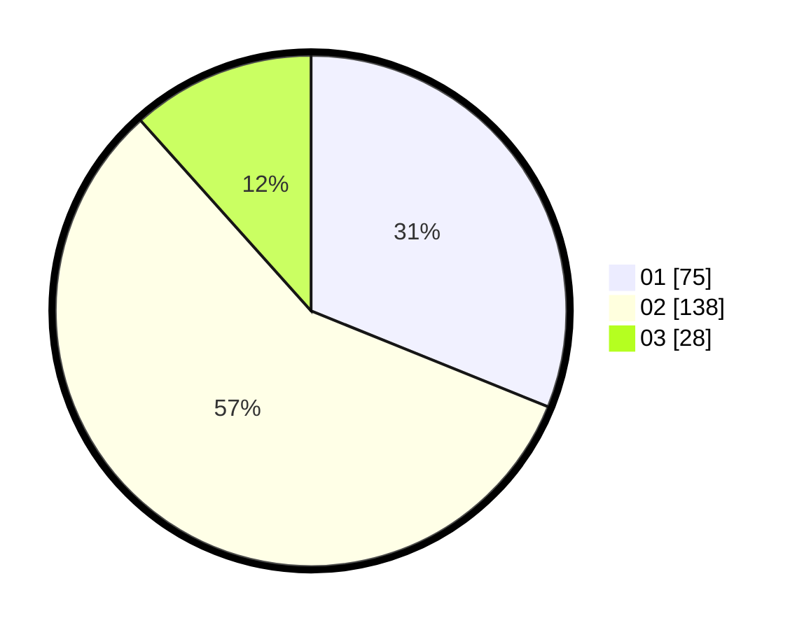

# Hasil

Hasil perolehan suara paslon dapat dilihat pada file paslon-01.txt, paslon-02.txt, dan paslon-03.txt.

Jika tidak ada, artinya data tersebut belum ada pada SIREKAP.

## Perolehan Suara

 * Paslon 01: **75**.
 * Paslon 02: **138**.
 * Paslon 03: **28**.

## Foto C Plano

https://sirekap-obj-formc.kpu.go.id/346b/pemilu/ppwp/31/73/01/10/05/3173011005216-20240214-193158--f1ca710d-de05-4fda-83c3-66c5981c820e.jpg

https://sirekap-obj-formc.kpu.go.id/346b/pemilu/ppwp/31/73/01/10/05/3173011005216-20240214-193258--412abae0-b814-4e80-9585-948a7da9c460.jpg

https://sirekap-obj-formc.kpu.go.id/346b/pemilu/ppwp/31/73/01/10/05/3173011005216-20240214-193616--9f488a03-b6bc-4bcb-9844-45a0a74f007b.jpg
