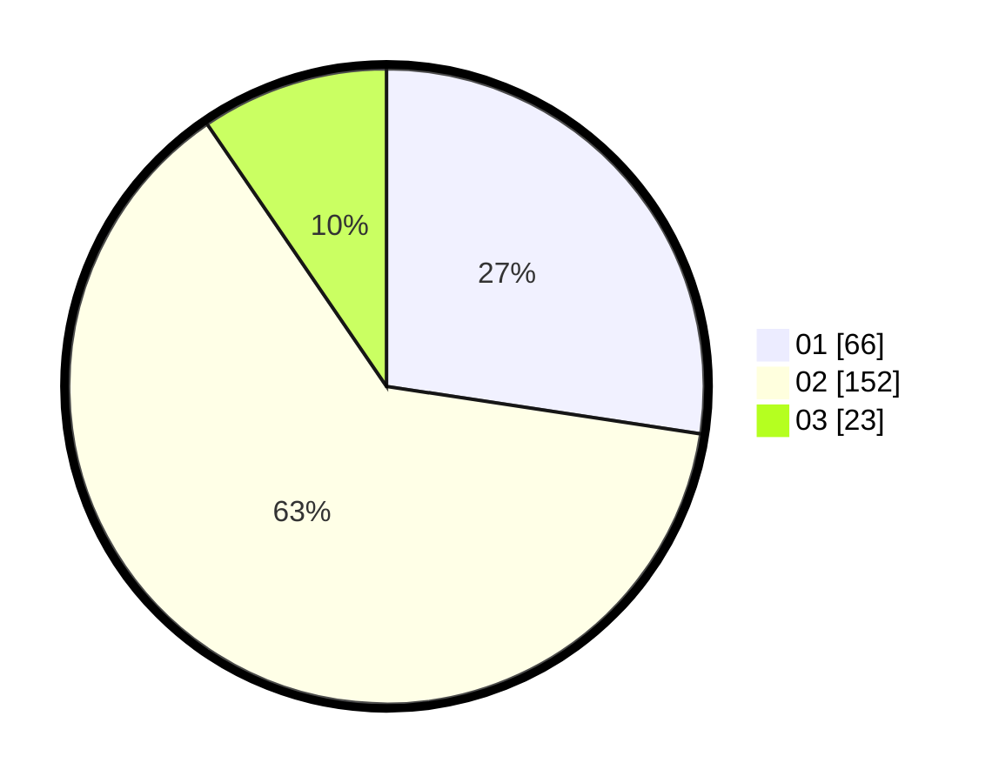

# Hasil

Hasil perolehan suara paslon dapat dilihat pada file paslon-01.txt, paslon-02.txt, dan paslon-03.txt.

Jika tidak ada, artinya data tersebut belum ada pada SIREKAP.

## Perolehan Suara

 * Paslon 01: **66**.
 * Paslon 02: **152**.
 * Paslon 03: **23**.

## Foto C Plano

https://sirekap-obj-formc.kpu.go.id/e6ed/pemilu/ppwp/31/73/01/10/05/3173011005223-20240214-232105--3176b3fc-249d-4024-8acf-e3a9691638c9.jpg

https://sirekap-obj-formc.kpu.go.id/e6ed/pemilu/ppwp/31/73/01/10/05/3173011005223-20240214-233253--d2970b54-9c6b-4996-95b6-302d9baf3c6f.jpg

https://sirekap-obj-formc.kpu.go.id/e6ed/pemilu/ppwp/31/73/01/10/05/3173011005223-20240214-234845--f429c00d-28d5-49ad-8f4c-301625a9af8c.jpg
