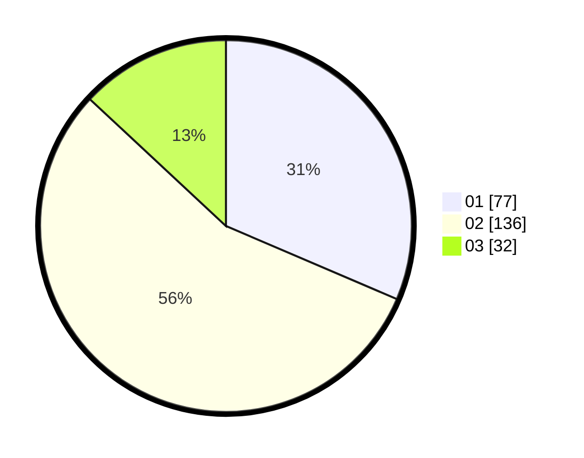

# Hasil

Hasil perolehan suara paslon dapat dilihat pada file paslon-01.txt, paslon-02.txt, dan paslon-03.txt.

Jika tidak ada, artinya data tersebut belum ada pada SIREKAP.

## Perolehan Suara

 * Paslon 01: **77**.
 * Paslon 02: **136**.
 * Paslon 03: **32**.

## Foto C Plano

https://sirekap-obj-formc.kpu.go.id/7055/pemilu/ppwp/31/73/01/10/05/3173011005225-20240214-223738--701b26c3-03d7-4420-a7a3-e49ed9813cc9.jpg

https://sirekap-obj-formc.kpu.go.id/7055/pemilu/ppwp/31/73/01/10/05/3173011005225-20240214-223913--4166b110-2046-4567-80f6-19861b660c7c.jpg

https://sirekap-obj-formc.kpu.go.id/7055/pemilu/ppwp/31/73/01/10/05/3173011005225-20240214-224114--49a6d463-6432-42b1-9280-1a8fbdae0a1f.jpg
