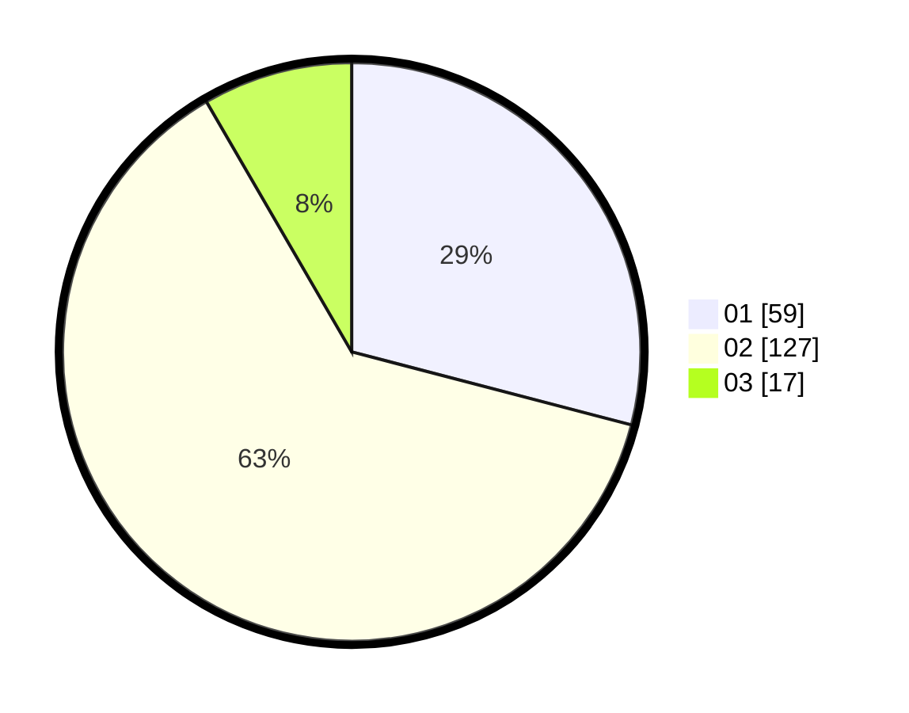

# Hasil

Hasil perolehan suara paslon dapat dilihat pada file paslon-01.txt, paslon-02.txt, dan paslon-03.txt.

Jika tidak ada, artinya data tersebut belum ada pada SIREKAP.

## Perolehan Suara

 * Paslon 01: **59**.
 * Paslon 02: **127**.
 * Paslon 03: **17**.

## Foto C Plano

https://sirekap-obj-formc.kpu.go.id/5305/pemilu/ppwp/31/73/01/10/05/3173011005233-20240214-195953--1894e160-ebaf-4dd1-9d4e-857370161db3.jpg

https://sirekap-obj-formc.kpu.go.id/5305/pemilu/ppwp/31/73/01/10/05/3173011005233-20240214-200043--95ec3c45-2989-4681-8ba9-dde144b6a1de.jpg

https://sirekap-obj-formc.kpu.go.id/5305/pemilu/ppwp/31/73/01/10/05/3173011005233-20240214-194649--63de47f4-bb73-42af-83a1-39452c853d47.jpg

## DATA PEMILIH TETAP

Jumlah pemilih dalam DPT: **288**.
 * L: **148**.
 * P: **140**.

## DATA PENGGUNA HAK PILIH

Jumlah pengguna hak pilih dalam DPT: **206**.
 * L: **107**.
 * P: **99**.

Jumlah pengguna hak pilih dalam DPTb: **0**.
 * L: **0**.
 * P: **0**.

Jumlah pengguna hak pilih dalam DPK: **0**.
 * L: **0**.
 * P: **0**.

Jumlah pengguna hak pilih: **206**.
 * L: **107**.
 * P: **99**.

## JUMLAH SUARA SAH DAN TIDAK SAH

JUMLAH SELURUH SUARA SAH: **203**.

JUMLAH SUARA TIDAK SAH: **3**.

JUMLAH SELURUH SUARA SAH DAN SUARA TIDAK SAH: **206**.
