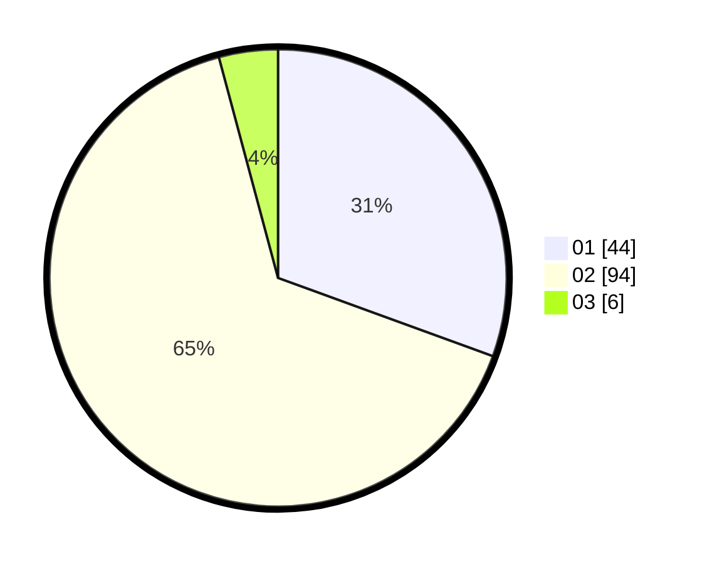

# Hasil

Hasil perolehan suara paslon dapat dilihat pada file paslon-01.txt, paslon-02.txt, dan paslon-03.txt.

Jika tidak ada, artinya data tersebut belum ada pada SIREKAP.

## Perolehan Suara

 * Paslon 01: **44**.
 * Paslon 02: **94**.
 * Paslon 03: **6**.

## Foto C Plano

https://sirekap-obj-formc.kpu.go.id/0083/pemilu/ppwp/31/73/01/10/05/3173011005234-20240214-222712--71ca0dd7-a7eb-4d6b-95a2-833919a71483.jpg

https://sirekap-obj-formc.kpu.go.id/0083/pemilu/ppwp/31/73/01/10/05/3173011005234-20240214-222953--b60ef25a-a671-4a75-8318-21eef5079f3c.jpg

https://sirekap-obj-formc.kpu.go.id/0083/pemilu/ppwp/31/73/01/10/05/3173011005234-20240214-223049--8a84f1c5-05e2-497b-95c2-6cfb0c765cf8.jpg
