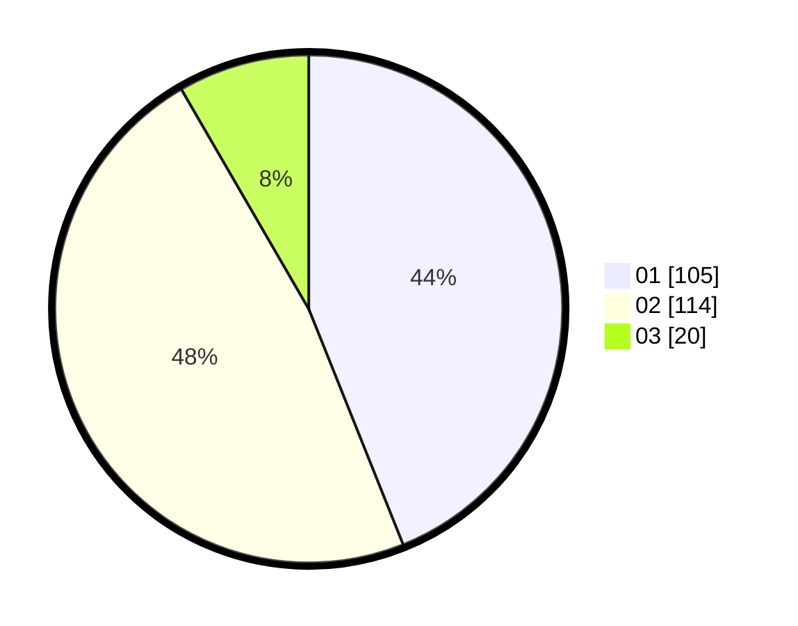

# Hasil

Hasil perolehan suara paslon dapat dilihat pada file paslon-01.txt, paslon-02.txt, dan paslon-03.txt.

Jika tidak ada, artinya data tersebut belum ada pada SIREKAP.

## Perolehan Suara

 * Paslon 01: **105**.
 * Paslon 02: **114**.
 * Paslon 03: **20**.

## Foto C Plano

https://sirekap-obj-formc.kpu.go.id/64a0/pemilu/ppwp/31/73/01/10/05/3173011005238-20240214-223706--61959fdb-22d8-4200-892b-48941f3f5b84.jpg

https://sirekap-obj-formc.kpu.go.id/64a0/pemilu/ppwp/31/73/01/10/05/3173011005238-20240214-223849--f3f08eab-9704-41d8-894d-a27801b82b76.jpg

https://sirekap-obj-formc.kpu.go.id/64a0/pemilu/ppwp/31/73/01/10/05/3173011005238-20240214-224020--4a8543a5-726d-4477-a864-fd9a1919973c.jpg
