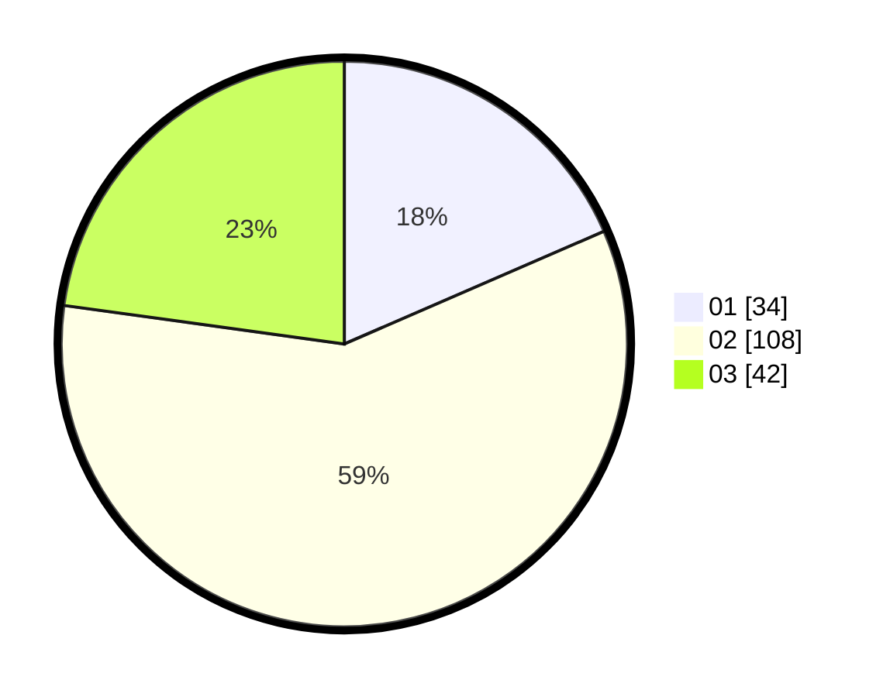

# Hasil

Hasil perolehan suara paslon dapat dilihat pada file paslon-01.txt, paslon-02.txt, dan paslon-03.txt.

Jika tidak ada, artinya data tersebut belum ada pada SIREKAP.

## Perolehan Suara

 * Paslon 01: **34**.
 * Paslon 02: **108**.
 * Paslon 03: **42**.

## Foto C Plano

https://sirekap-obj-formc.kpu.go.id/6de5/pemilu/ppwp/31/73/01/10/05/3173011005242-20240216-143903--8ce984e6-c7e4-45b1-9a60-6742ae7dc3ac.jpg

https://sirekap-obj-formc.kpu.go.id/6de5/pemilu/ppwp/31/73/01/10/05/3173011005242-20240216-143905--a22183a1-c397-464f-87f5-0a3136f9f873.jpg

https://sirekap-obj-formc.kpu.go.id/6de5/pemilu/ppwp/31/73/01/10/05/3173011005242-20240216-143904--44c3cfc8-52bb-43ee-98bc-f6ac0cd5fa2e.jpg

## DATA PEMILIH TETAP

Jumlah pemilih dalam DPT: **282**.
 * L: **151**.
 * P: **131**.

## DATA PENGGUNA HAK PILIH

Jumlah pengguna hak pilih dalam DPT: **188**.
 * L: **99**.
 * P: **89**.

Jumlah pengguna hak pilih dalam DPTb: **0**.
 * L: **0**.
 * P: **0**.

Jumlah pengguna hak pilih dalam DPK: **0**.
 * L: **0**.
 * P: **0**.

Jumlah pengguna hak pilih: **188**.
 * L: **99**.
 * P: **89**.

## JUMLAH SUARA SAH DAN TIDAK SAH

JUMLAH SELURUH SUARA SAH: **184**.

JUMLAH SUARA TIDAK SAH: **4**.

JUMLAH SELURUH SUARA SAH DAN SUARA TIDAK SAH: **188**.
