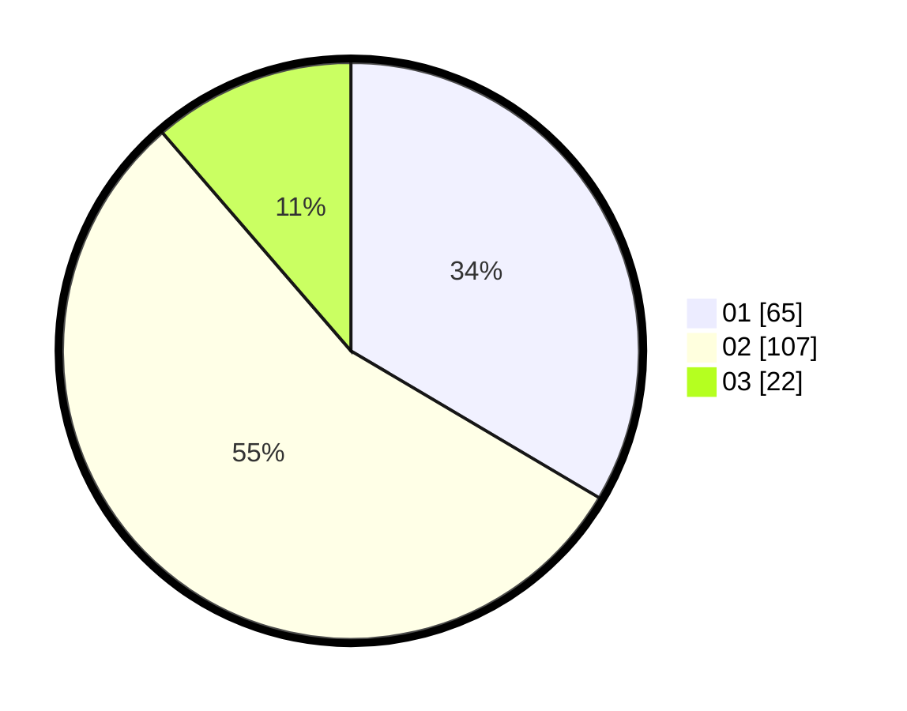

# Hasil

Hasil perolehan suara paslon dapat dilihat pada file paslon-01.txt, paslon-02.txt, dan paslon-03.txt.

Jika tidak ada, artinya data tersebut belum ada pada SIREKAP.

## Perolehan Suara

 * Paslon 01: **65**.
 * Paslon 02: **107**.
 * Paslon 03: **22**.

## Foto C Plano

https://sirekap-obj-formc.kpu.go.id/cf06/pemilu/ppwp/31/73/01/10/05/3173011005243-20240215-041332--44b3b48f-9b43-405b-a717-182e583af3e8.jpg

https://sirekap-obj-formc.kpu.go.id/cf06/pemilu/ppwp/31/73/01/10/05/3173011005243-20240215-132744--bdf7189b-7dc1-4ce3-b967-d8ee0d1d0c98.jpg

https://sirekap-obj-formc.kpu.go.id/cf06/pemilu/ppwp/31/73/01/10/05/3173011005243-20240215-132938--adf8b980-1c68-4f7c-9784-241efb6dbac6.jpg
