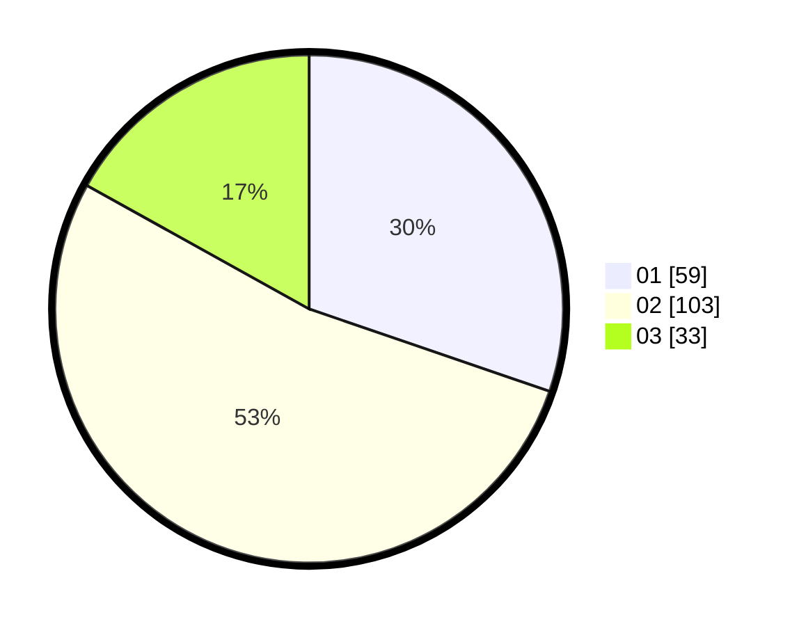

# Hasil

Hasil perolehan suara paslon dapat dilihat pada file paslon-01.txt, paslon-02.txt, dan paslon-03.txt.

Jika tidak ada, artinya data tersebut belum ada pada SIREKAP.

## Perolehan Suara

 * Paslon 01: **59**.
 * Paslon 02: **103**.
 * Paslon 03: **33**.

## Foto C Plano

https://sirekap-obj-formc.kpu.go.id/e160/pemilu/ppwp/31/73/01/10/05/3173011005249-20240214-225019--9b621f41-15a6-4bc0-8ff2-aace2451445b.jpg

https://sirekap-obj-formc.kpu.go.id/e160/pemilu/ppwp/31/73/01/10/05/3173011005249-20240214-225158--2b62b148-d559-4806-a841-d45eea7a8fc8.jpg

https://sirekap-obj-formc.kpu.go.id/e160/pemilu/ppwp/31/73/01/10/05/3173011005249-20240214-215747--51821a12-7093-406d-a3fe-34edb6e8254d.jpg
