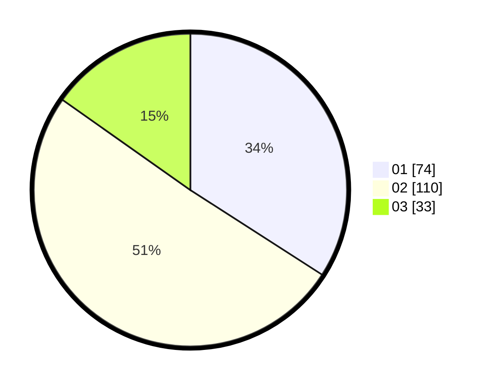

# Hasil

Hasil perolehan suara paslon dapat dilihat pada file paslon-01.txt, paslon-02.txt, dan paslon-03.txt.

Jika tidak ada, artinya data tersebut belum ada pada SIREKAP.

## Perolehan Suara

 * Paslon 01: **74**.
 * Paslon 02: **110**.
 * Paslon 03: **33**.

## Foto C Plano

https://sirekap-obj-formc.kpu.go.id/2668/pemilu/ppwp/31/73/01/10/05/3173011005252-20240214-235133--826579c4-12e0-4968-bdd5-9f9e7bbe72a8.jpg

https://sirekap-obj-formc.kpu.go.id/2668/pemilu/ppwp/31/73/01/10/05/3173011005252-20240214-235220--7b2d78f7-27dd-4ffd-a47b-28aeb200895d.jpg

https://sirekap-obj-formc.kpu.go.id/2668/pemilu/ppwp/31/73/01/10/05/3173011005252-20240214-235240--d89ef6b3-d71e-46d5-bc87-f6b31c261b9e.jpg
