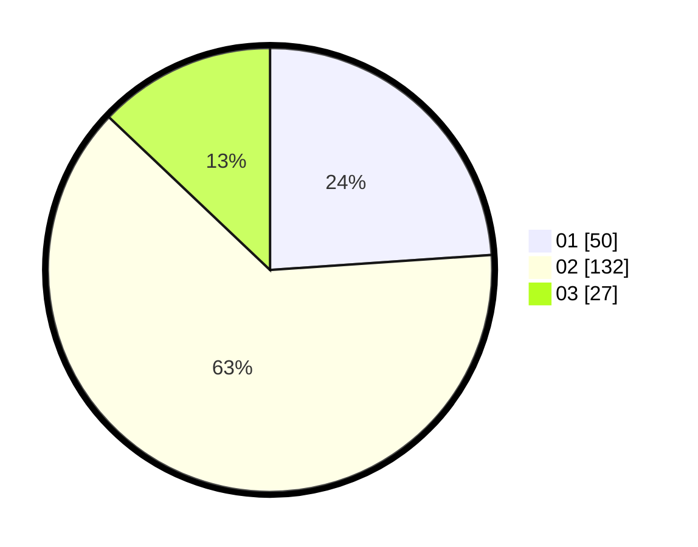

# Hasil

Hasil perolehan suara paslon dapat dilihat pada file paslon-01.txt, paslon-02.txt, dan paslon-03.txt.

Jika tidak ada, artinya data tersebut belum ada pada SIREKAP.

## Perolehan Suara

 * Paslon 01: **50**.
 * Paslon 02: **132**.
 * Paslon 03: **27**.

## Foto C Plano

https://sirekap-obj-formc.kpu.go.id/70aa/pemilu/ppwp/31/73/01/10/05/3173011005253-20240214-214729--e42030e5-91cb-4224-a209-af801864323d.jpg

https://sirekap-obj-formc.kpu.go.id/70aa/pemilu/ppwp/31/73/01/10/05/3173011005253-20240215-003206--a5c0f61b-1770-4edf-8782-8c04b96a04ef.jpg

https://sirekap-obj-formc.kpu.go.id/70aa/pemilu/ppwp/31/73/01/10/05/3173011005253-20240214-205342--4ffc43f5-b732-473a-b757-c373a9f46f02.jpg
