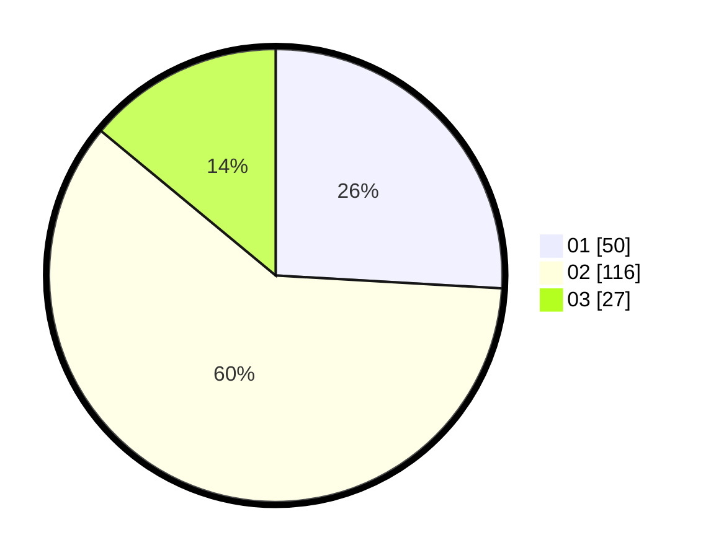

# Hasil

Hasil perolehan suara paslon dapat dilihat pada file paslon-01.txt, paslon-02.txt, dan paslon-03.txt.

Jika tidak ada, artinya data tersebut belum ada pada SIREKAP.

## Perolehan Suara

 * Paslon 01: **50**.
 * Paslon 02: **116**.
 * Paslon 03: **27**.

## Foto C Plano

https://sirekap-obj-formc.kpu.go.id/bc09/pemilu/ppwp/31/73/01/10/05/3173011005258-20240216-032800--09fe6ec0-10a1-48c4-b09f-9850aee3e33b.jpg

https://sirekap-obj-formc.kpu.go.id/bc09/pemilu/ppwp/31/73/01/10/05/3173011005258-20240216-032802--03ad8add-b2ef-4538-aa5f-26c05d6150f7.jpg

https://sirekap-obj-formc.kpu.go.id/bc09/pemilu/ppwp/31/73/01/10/05/3173011005258-20240216-032801--c1af7de9-5b68-4b33-8801-7247a908f8a2.jpg

## DATA PEMILIH TETAP

Jumlah pemilih dalam DPT: **271**.
 * L: **136**.
 * P: **135**.

## DATA PENGGUNA HAK PILIH

Jumlah pengguna hak pilih dalam DPT: **195**.
 * L: **96**.
 * P: **99**.

Jumlah pengguna hak pilih dalam DPTb: **1**.
 * L: **1**.
 * P: **0**.

Jumlah pengguna hak pilih dalam DPK: **0**.
 * L: **0**.
 * P: **0**.

Jumlah pengguna hak pilih: **196**.
 * L: **97**.
 * P: **99**.

## JUMLAH SUARA SAH DAN TIDAK SAH

JUMLAH SELURUH SUARA SAH: **192**.

JUMLAH SUARA TIDAK SAH: **3**.

JUMLAH SELURUH SUARA SAH DAN SUARA TIDAK SAH: **195**.
