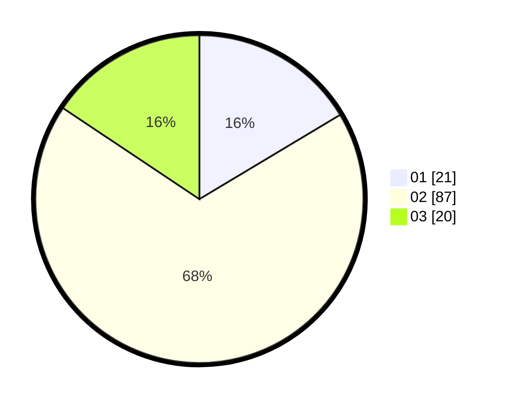

# Hasil

Hasil perolehan suara paslon dapat dilihat pada file paslon-01.txt, paslon-02.txt, dan paslon-03.txt.

Jika tidak ada, artinya data tersebut belum ada pada SIREKAP.

## Perolehan Suara

 * Paslon 01: **21**.
 * Paslon 02: **87**.
 * Paslon 03: **20**.

## Foto C Plano

https://sirekap-obj-formc.kpu.go.id/7caf/pemilu/ppwp/31/73/01/10/05/3173011005260-20240214-221608--2c1778df-6409-4091-b1c9-396208a12521.jpg

https://sirekap-obj-formc.kpu.go.id/7caf/pemilu/ppwp/31/73/01/10/05/3173011005260-20240214-232159--aa005e52-e4e6-48cf-b920-75ee65e994a9.jpg

https://sirekap-obj-formc.kpu.go.id/7caf/pemilu/ppwp/31/73/01/10/05/3173011005260-20240214-235025--d3333d0c-f0af-426c-a305-76171f462b16.jpg
