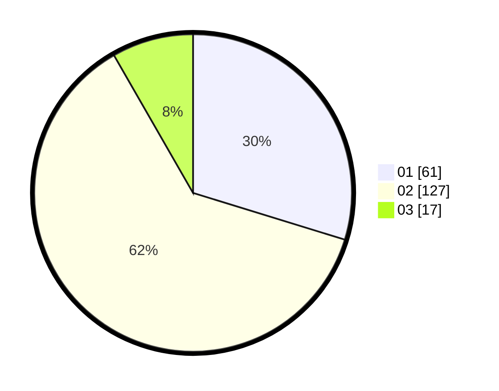

# Hasil

Hasil perolehan suara paslon dapat dilihat pada file paslon-01.txt, paslon-02.txt, dan paslon-03.txt.

Jika tidak ada, artinya data tersebut belum ada pada SIREKAP.

## Perolehan Suara

 * Paslon 01: **61**.
 * Paslon 02: **127**.
 * Paslon 03: **17**.

## Foto C Plano

https://sirekap-obj-formc.kpu.go.id/70db/pemilu/ppwp/31/73/01/10/05/3173011005263-20240215-023012--5ad46e87-5422-4a4b-bb4c-c23d8fbb6b02.jpg

https://sirekap-obj-formc.kpu.go.id/70db/pemilu/ppwp/31/73/01/10/05/3173011005263-20240215-023205--ef67ba31-895f-4ffe-be41-403659387246.jpg

https://sirekap-obj-formc.kpu.go.id/70db/pemilu/ppwp/31/73/01/10/05/3173011005263-20240215-023314--1b42f83e-52bf-424f-bec8-d769a0724a92.jpg
