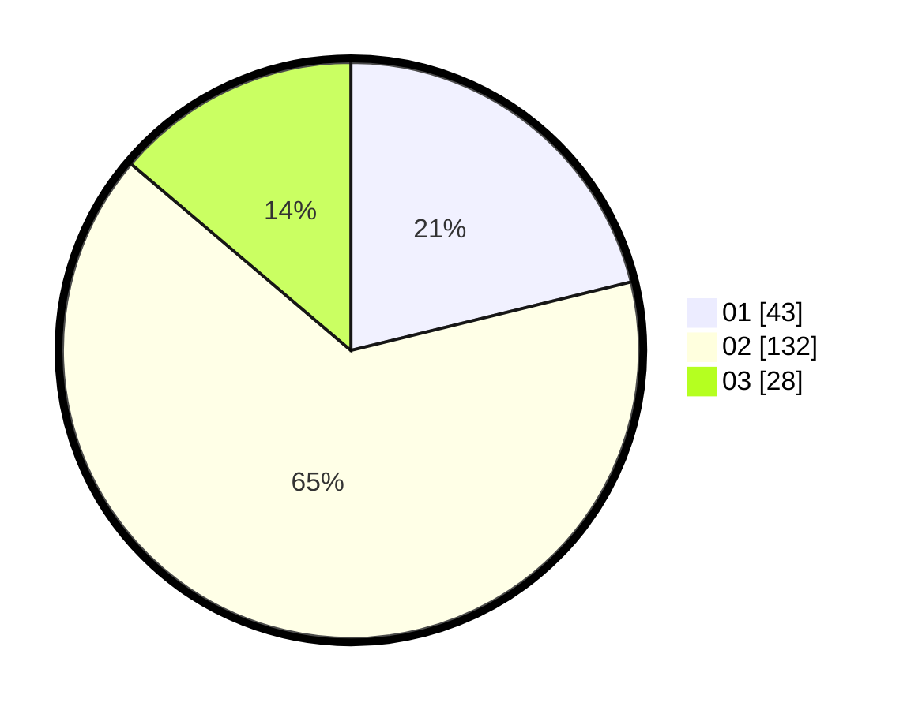

# Hasil

Hasil perolehan suara paslon dapat dilihat pada file paslon-01.txt, paslon-02.txt, dan paslon-03.txt.

Jika tidak ada, artinya data tersebut belum ada pada SIREKAP.

## Perolehan Suara

 * Paslon 01: **43**.
 * Paslon 02: **132**.
 * Paslon 03: **28**.

## Foto C Plano

https://sirekap-obj-formc.kpu.go.id/d5ca/pemilu/ppwp/31/73/01/10/05/3173011005264-20240215-014739--baa2e230-b3df-4aaf-a8c2-4ee0b4de3bd4.jpg

https://sirekap-obj-formc.kpu.go.id/d5ca/pemilu/ppwp/31/73/01/10/05/3173011005264-20240215-014642--fbf3870a-bd5d-4605-b4a7-6ec334052a35.jpg

https://sirekap-obj-formc.kpu.go.id/d5ca/pemilu/ppwp/31/73/01/10/05/3173011005264-20240215-014934--dd565ebf-d7f6-4ddb-9f2d-25b9e7901b95.jpg
