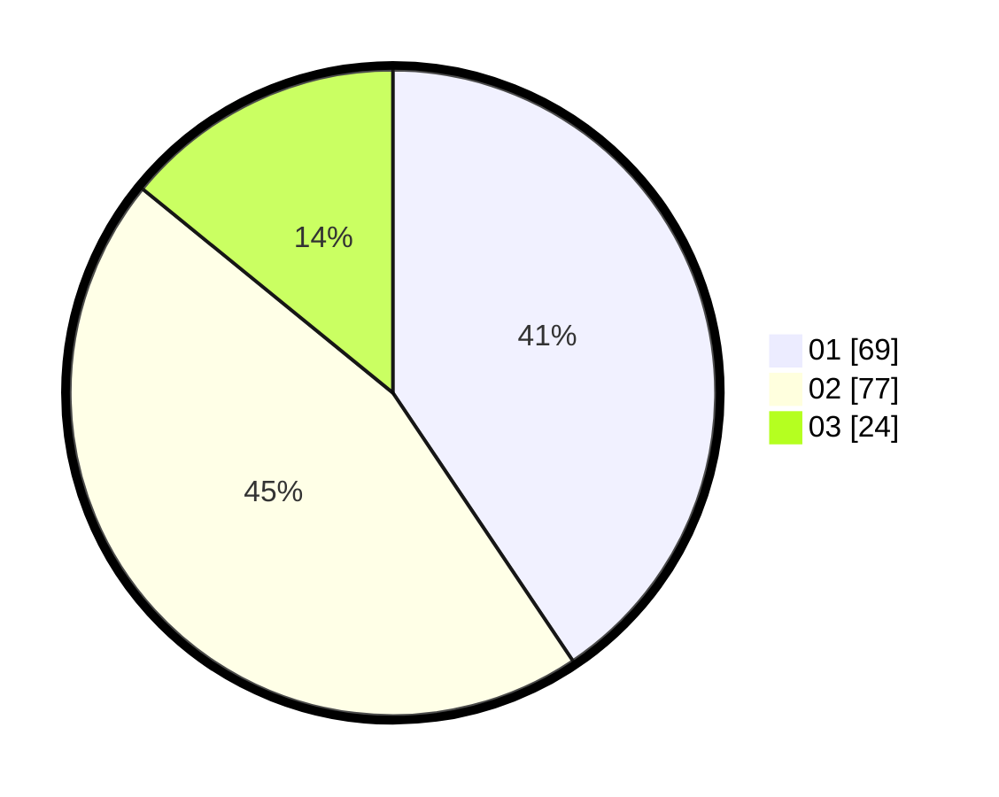

# Hasil

Hasil perolehan suara paslon dapat dilihat pada file paslon-01.txt, paslon-02.txt, dan paslon-03.txt.

Jika tidak ada, artinya data tersebut belum ada pada SIREKAP.

## Perolehan Suara

 * Paslon 01: **69**.
 * Paslon 02: **77**.
 * Paslon 03: **24**.

## Foto C Plano

https://sirekap-obj-formc.kpu.go.id/0b97/pemilu/ppwp/31/73/01/10/05/3173011005273-20240215-121112--a64ff864-f584-45e7-8cc6-957e017f8fe4.jpg

https://sirekap-obj-formc.kpu.go.id/0b97/pemilu/ppwp/31/73/01/10/05/3173011005273-20240214-230926--969ea290-de07-4b5e-940d-5ab3cfb1d965.jpg

https://sirekap-obj-formc.kpu.go.id/0b97/pemilu/ppwp/31/73/01/10/05/3173011005273-20240214-230811--7cba7aaf-0d96-4b55-9e81-829793c1ce5b.jpg

## DATA PEMILIH TETAP

Jumlah pemilih dalam DPT: **264**.
 * L: **129**.
 * P: **135**.

## DATA PENGGUNA HAK PILIH

Jumlah pengguna hak pilih dalam DPT: **176**.
 * L: **88**.
 * P: **88**.

Jumlah pengguna hak pilih dalam DPTb: **0**.
 * L: **0**.
 * P: **0**.

Jumlah pengguna hak pilih dalam DPK: **1**.
 * L: **0**.
 * P: **1**.

Jumlah pengguna hak pilih: **177**.
 * L: **88**.
 * P: **89**.

## JUMLAH SUARA SAH DAN TIDAK SAH

JUMLAH SELURUH SUARA SAH: **170**.

JUMLAH SUARA TIDAK SAH: **7**.

JUMLAH SELURUH SUARA SAH DAN SUARA TIDAK SAH: **177**.
