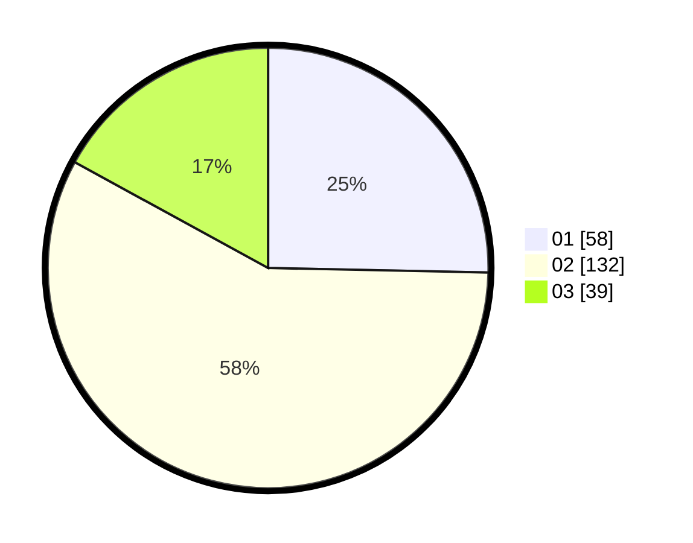

# Hasil

Hasil perolehan suara paslon dapat dilihat pada file paslon-01.txt, paslon-02.txt, dan paslon-03.txt.

Jika tidak ada, artinya data tersebut belum ada pada SIREKAP.

## Perolehan Suara

 * Paslon 01: **58**.
 * Paslon 02: **132**.
 * Paslon 03: **39**.

## Foto C Plano

https://sirekap-obj-formc.kpu.go.id/ad06/pemilu/ppwp/31/73/01/10/05/3173011005274-20240214-230526--9165b590-a7f6-413c-98b8-6cadd3207042.jpg

https://sirekap-obj-formc.kpu.go.id/ad06/pemilu/ppwp/31/73/01/10/05/3173011005274-20240214-224056--031f602a-290f-4f8e-a803-5f04f547c2ef.jpg

https://sirekap-obj-formc.kpu.go.id/ad06/pemilu/ppwp/31/73/01/10/05/3173011005274-20240214-224235--d7427642-0405-4a6c-a03e-7f00885a17af.jpg
