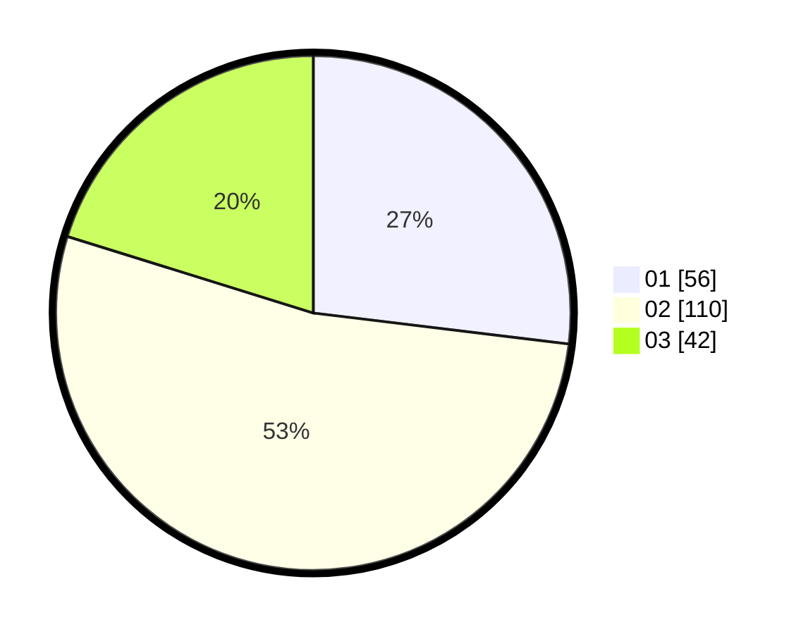

# Hasil

Hasil perolehan suara paslon dapat dilihat pada file paslon-01.txt, paslon-02.txt, dan paslon-03.txt.

Jika tidak ada, artinya data tersebut belum ada pada SIREKAP.

## Perolehan Suara

 * Paslon 01: **56**.
 * Paslon 02: **110**.
 * Paslon 03: **42**.

## Foto C Plano

https://sirekap-obj-formc.kpu.go.id/880a/pemilu/ppwp/31/73/01/10/05/3173011005278-20240215-040546--072cc437-1d4a-47c2-b154-93634d1343ed.jpg

https://sirekap-obj-formc.kpu.go.id/880a/pemilu/ppwp/31/73/01/10/05/3173011005278-20240215-041042--0442ba13-57d3-4f13-a2df-76287f025a11.jpg

https://sirekap-obj-formc.kpu.go.id/880a/pemilu/ppwp/31/73/01/10/05/3173011005278-20240215-043045--71e55273-b6b9-47f6-8211-0fdc252bd242.jpg
