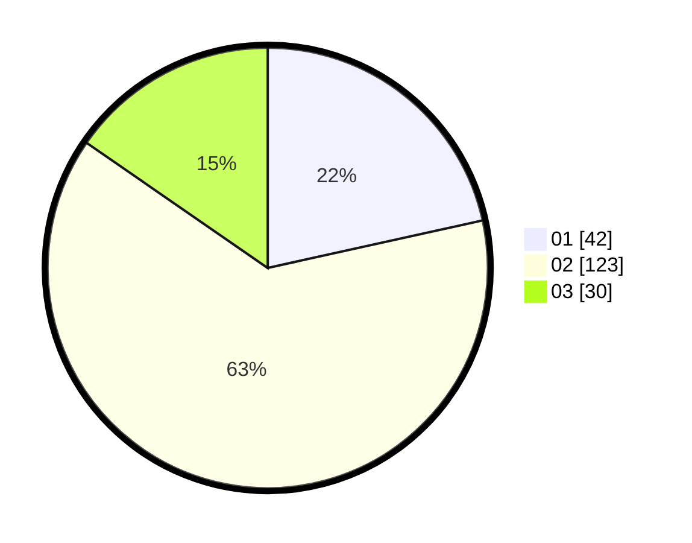

# Hasil

Hasil perolehan suara paslon dapat dilihat pada file paslon-01.txt, paslon-02.txt, dan paslon-03.txt.

Jika tidak ada, artinya data tersebut belum ada pada SIREKAP.

## Perolehan Suara

 * Paslon 01: **42**.
 * Paslon 02: **123**.
 * Paslon 03: **30**.

## Foto C Plano

https://sirekap-obj-formc.kpu.go.id/23b0/pemilu/ppwp/31/73/01/10/05/3173011005282-20240214-195105--78449989-d0d0-4953-a1cd-ce1f0e4209df.jpg

https://sirekap-obj-formc.kpu.go.id/23b0/pemilu/ppwp/31/73/01/10/05/3173011005282-20240214-195406--004fb366-9e96-47e9-ac0d-edc40e51bea6.jpg

https://sirekap-obj-formc.kpu.go.id/23b0/pemilu/ppwp/31/73/01/10/05/3173011005282-20240214-195550--6cd64443-e628-4f2f-846d-4732feca13ae.jpg

## DATA PEMILIH TETAP

Jumlah pemilih dalam DPT: **276**.
 * L: **138**.
 * P: **138**.

## DATA PENGGUNA HAK PILIH

Jumlah pengguna hak pilih dalam DPT: **195**.
 * L: **97**.
 * P: **98**.

Jumlah pengguna hak pilih dalam DPTb: **0**.
 * L: **0**.
 * P: **0**.

Jumlah pengguna hak pilih dalam DPK: **3**.
 * L: **0**.
 * P: **3**.

Jumlah pengguna hak pilih: **198**.
 * L: **97**.
 * P: **101**.

## JUMLAH SUARA SAH DAN TIDAK SAH

JUMLAH SELURUH SUARA SAH: **195**.

JUMLAH SUARA TIDAK SAH: **3**.

JUMLAH SELURUH SUARA SAH DAN SUARA TIDAK SAH: **198**.
