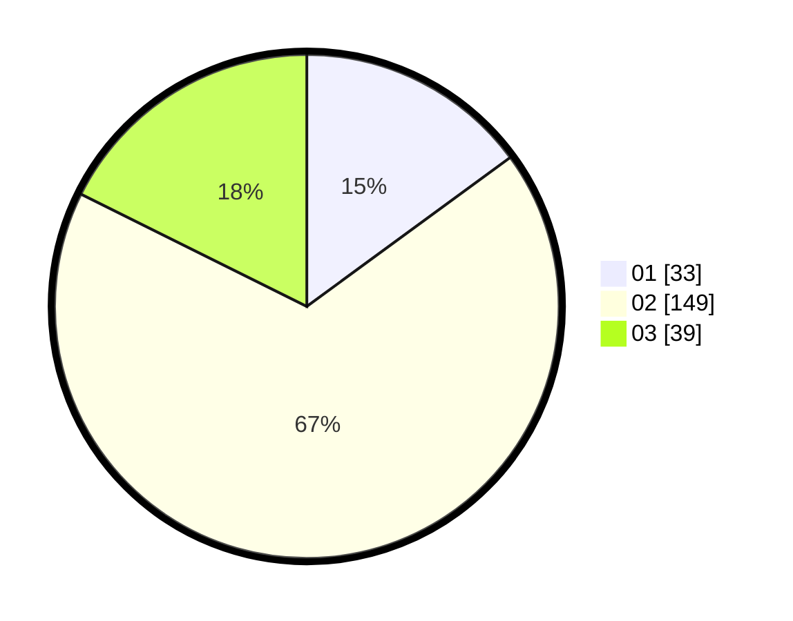

# Hasil

Hasil perolehan suara paslon dapat dilihat pada file paslon-01.txt, paslon-02.txt, dan paslon-03.txt.

Jika tidak ada, artinya data tersebut belum ada pada SIREKAP.

## Perolehan Suara

 * Paslon 01: **33**.
 * Paslon 02: **149**.
 * Paslon 03: **39**.

## Foto C Plano

https://sirekap-obj-formc.kpu.go.id/88aa/pemilu/ppwp/31/73/01/10/05/3173011005283-20240216-155320--5b84a972-5b7d-45a7-8176-88ebc6e0eb5f.jpg

https://sirekap-obj-formc.kpu.go.id/88aa/pemilu/ppwp/31/73/01/10/05/3173011005283-20240216-155322--001c6167-970c-45de-ae15-75ea04444125.jpg

https://sirekap-obj-formc.kpu.go.id/88aa/pemilu/ppwp/31/73/01/10/05/3173011005283-20240216-155321--45e49899-8449-4485-9062-92d2e29bdcc6.jpg

## DATA PEMILIH TETAP

Jumlah pemilih dalam DPT: **285**.
 * L: **145**.
 * P: **140**.

## DATA PENGGUNA HAK PILIH

Jumlah pengguna hak pilih dalam DPT: **226**.
 * L: **106**.
 * P: **120**.

Jumlah pengguna hak pilih dalam DPTb: **0**.
 * L: **0**.
 * P: **0**.

Jumlah pengguna hak pilih dalam DPK: **1**.
 * L: **1**.
 * P: **0**.

Jumlah pengguna hak pilih: **227**.
 * L: **107**.
 * P: **120**.

## JUMLAH SUARA SAH DAN TIDAK SAH

JUMLAH SELURUH SUARA SAH: **221**.

JUMLAH SUARA TIDAK SAH: **6**.

JUMLAH SELURUH SUARA SAH DAN SUARA TIDAK SAH: **227**.
