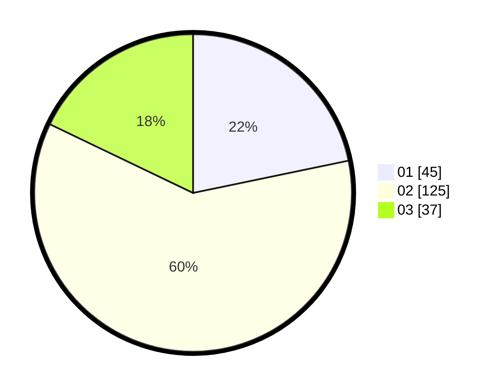

# Hasil

Hasil perolehan suara paslon dapat dilihat pada file paslon-01.txt, paslon-02.txt, dan paslon-03.txt.

Jika tidak ada, artinya data tersebut belum ada pada SIREKAP.

## Perolehan Suara

 * Paslon 01: **45**.
 * Paslon 02: **125**.
 * Paslon 03: **37**.

## Foto C Plano

https://sirekap-obj-formc.kpu.go.id/231e/pemilu/ppwp/31/73/01/10/05/3173011005284-20240216-172744--20b05301-95aa-4877-878a-28b7cfe3f5fe.jpg

https://sirekap-obj-formc.kpu.go.id/231e/pemilu/ppwp/31/73/01/10/05/3173011005284-20240216-172745--5c0a4814-2559-492e-8e3b-ff0e1e0493ac.jpg

https://sirekap-obj-formc.kpu.go.id/231e/pemilu/ppwp/31/73/01/10/05/3173011005284-20240216-172745--9d33dd1b-62c6-4019-9d1d-c76f4b012906.jpg

## DATA PEMILIH TETAP

Jumlah pemilih dalam DPT: **292**.
 * L: **149**.
 * P: **143**.

## DATA PENGGUNA HAK PILIH

Jumlah pengguna hak pilih dalam DPT: **210**.
 * L: **94**.
 * P: **116**.

Jumlah pengguna hak pilih dalam DPTb: **2**.
 * L: **1**.
 * P: **1**.

Jumlah pengguna hak pilih dalam DPK: **1**.
 * L: **1**.
 * P: **0**.

Jumlah pengguna hak pilih: **213**.
 * L: **96**.
 * P: **117**.

## JUMLAH SUARA SAH DAN TIDAK SAH

JUMLAH SELURUH SUARA SAH: **207**.

JUMLAH SUARA TIDAK SAH: **6**.

JUMLAH SELURUH SUARA SAH DAN SUARA TIDAK SAH: **213**.
