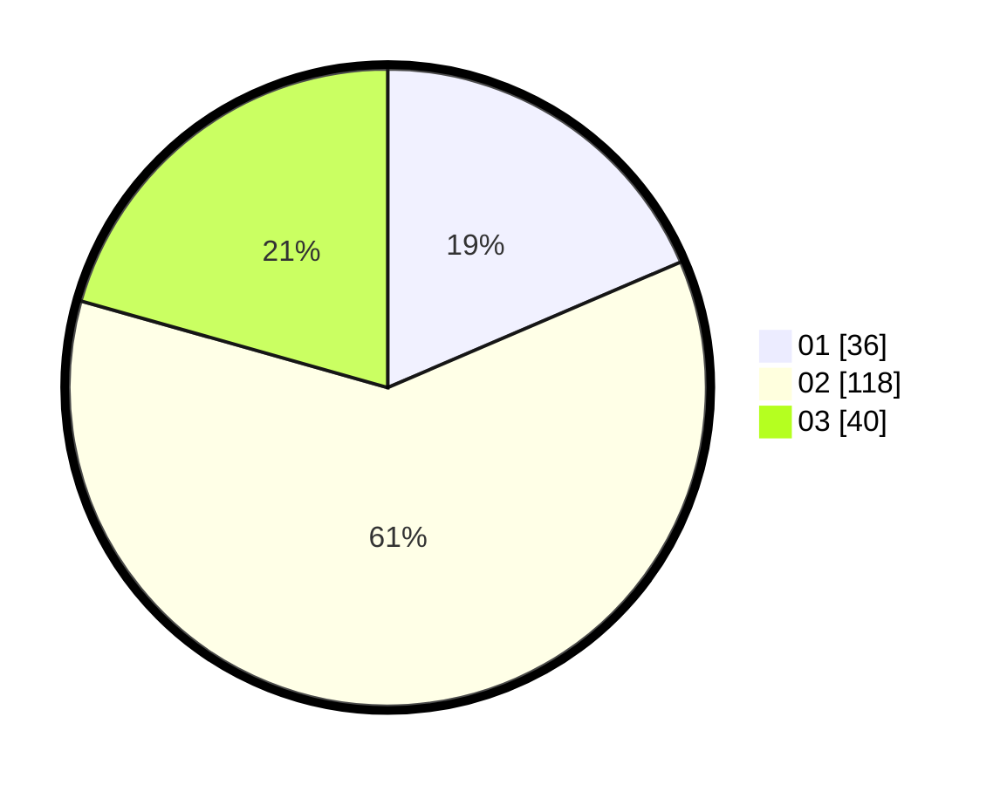

# Hasil

Hasil perolehan suara paslon dapat dilihat pada file paslon-01.txt, paslon-02.txt, dan paslon-03.txt.

Jika tidak ada, artinya data tersebut belum ada pada SIREKAP.

## Perolehan Suara

 * Paslon 01: **36**.
 * Paslon 02: **118**.
 * Paslon 03: **40**.

## Foto C Plano

https://sirekap-obj-formc.kpu.go.id/4c12/pemilu/ppwp/31/73/01/10/05/3173011005287-20240214-230619--a41f0629-a16d-455c-a5de-0d780229cfe3.jpg

https://sirekap-obj-formc.kpu.go.id/4c12/pemilu/ppwp/31/73/01/10/05/3173011005287-20240214-230737--835006cd-5850-4491-8fd9-4ea34e67bea5.jpg

https://sirekap-obj-formc.kpu.go.id/4c12/pemilu/ppwp/31/73/01/10/05/3173011005287-20240214-230944--f66aac1f-45b8-44df-91e1-571e03183b3e.jpg

## DATA PEMILIH TETAP

Jumlah pemilih dalam DPT: **280**.
 * L: **141**.
 * P: **139**.

## DATA PENGGUNA HAK PILIH

Jumlah pengguna hak pilih dalam DPT: **197**.
 * L: **96**.
 * P: **101**.

Jumlah pengguna hak pilih dalam DPTb: **0**.
 * L: **0**.
 * P: **0**.

Jumlah pengguna hak pilih dalam DPK: **0**.
 * L: **0**.
 * P: **0**.

Jumlah pengguna hak pilih: **197**.
 * L: **96**.
 * P: **101**.

## JUMLAH SUARA SAH DAN TIDAK SAH

JUMLAH SELURUH SUARA SAH: **194**.

JUMLAH SUARA TIDAK SAH: **3**.

JUMLAH SELURUH SUARA SAH DAN SUARA TIDAK SAH: **197**.
