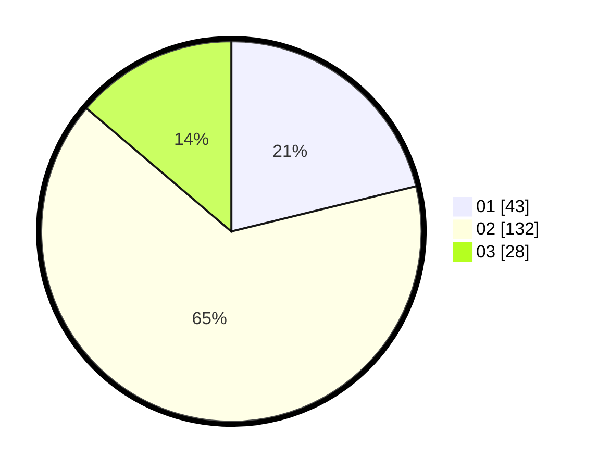

# Hasil

Hasil perolehan suara paslon dapat dilihat pada file paslon-01.txt, paslon-02.txt, dan paslon-03.txt.

Jika tidak ada, artinya data tersebut belum ada pada SIREKAP.

## Perolehan Suara

 * Paslon 01: **43**.
 * Paslon 02: **132**.
 * Paslon 03: **28**.

## Foto C Plano

https://sirekap-obj-formc.kpu.go.id/14cf/pemilu/ppwp/31/73/01/10/05/3173011005288-20240214-191158--6d713cbf-779e-4878-898b-1cae151f631c.jpg

https://sirekap-obj-formc.kpu.go.id/14cf/pemilu/ppwp/31/73/01/10/05/3173011005288-20240214-190637--383c8522-d7af-48c5-b992-cde2776b3e40.jpg

https://sirekap-obj-formc.kpu.go.id/14cf/pemilu/ppwp/31/73/01/10/05/3173011005288-20240214-191429--cb8424e3-a76f-46f5-ab11-f4139d7dba4d.jpg

## DATA PEMILIH TETAP

Jumlah pemilih dalam DPT: **269**.
 * L: **131**.
 * P: **138**.

## DATA PENGGUNA HAK PILIH

Jumlah pengguna hak pilih dalam DPT: **204**.
 * L: **95**.
 * P: **109**.

Jumlah pengguna hak pilih dalam DPTb: **0**.
 * L: **0**.
 * P: **0**.

Jumlah pengguna hak pilih dalam DPK: **1**.
 * L: **1**.
 * P: **0**.

Jumlah pengguna hak pilih: **205**.
 * L: **96**.
 * P: **109**.

## JUMLAH SUARA SAH DAN TIDAK SAH

JUMLAH SELURUH SUARA SAH: **203**.

JUMLAH SUARA TIDAK SAH: **2**.

JUMLAH SELURUH SUARA SAH DAN SUARA TIDAK SAH: **205**.
