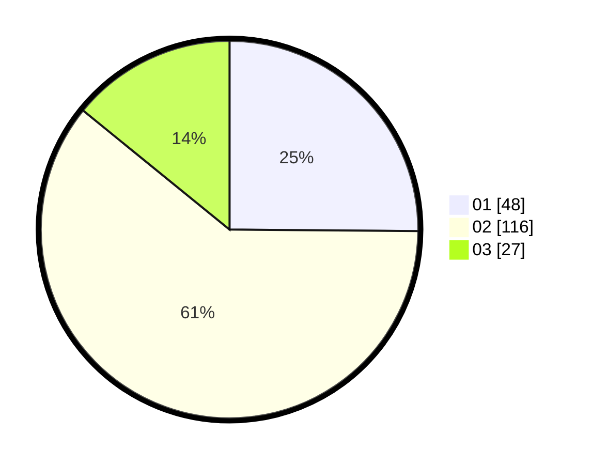

# Hasil

Hasil perolehan suara paslon dapat dilihat pada file paslon-01.txt, paslon-02.txt, dan paslon-03.txt.

Jika tidak ada, artinya data tersebut belum ada pada SIREKAP.

## Perolehan Suara

 * Paslon 01: **48**.
 * Paslon 02: **116**.
 * Paslon 03: **27**.

## Foto C Plano

https://sirekap-obj-formc.kpu.go.id/03cd/pemilu/ppwp/31/73/01/10/05/3173011005292-20240215-023346--c079fe3a-3597-44c4-b288-e953e4d9ace3.jpg

https://sirekap-obj-formc.kpu.go.id/03cd/pemilu/ppwp/31/73/01/10/05/3173011005292-20240215-022903--37ce7c00-9a20-4a57-bd9a-e411fca0e25d.jpg

https://sirekap-obj-formc.kpu.go.id/03cd/pemilu/ppwp/31/73/01/10/05/3173011005292-20240215-022957--f5148841-ebd2-417e-bf3c-68ceda08b8a6.jpg
