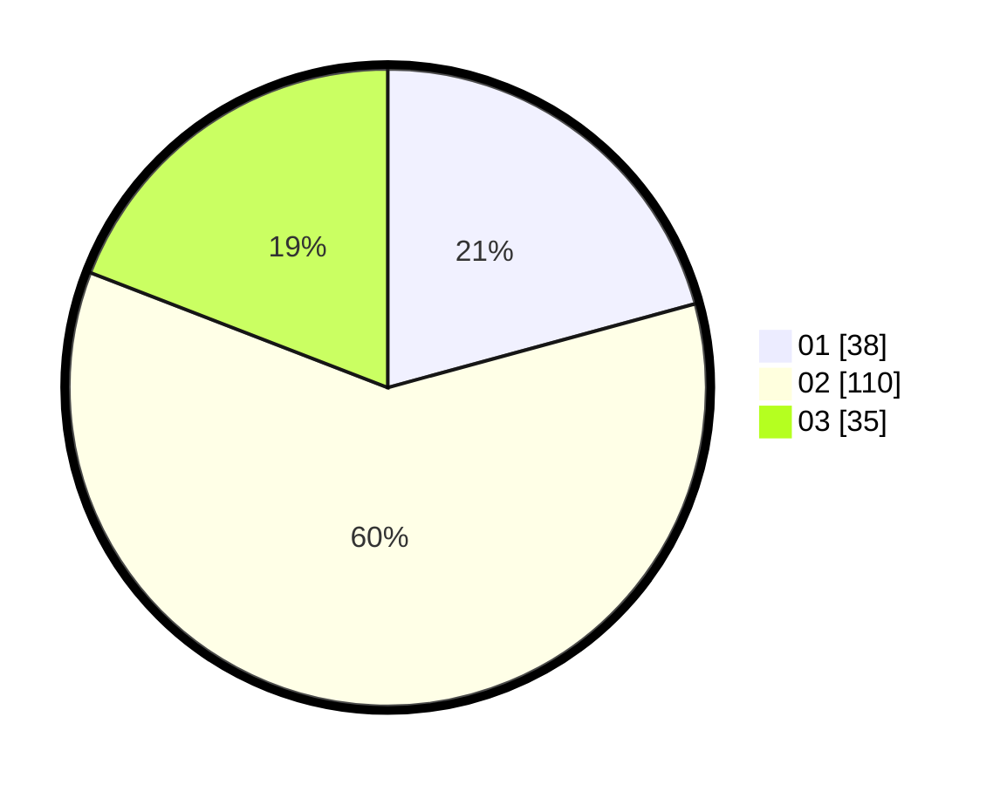

# Hasil

Hasil perolehan suara paslon dapat dilihat pada file paslon-01.txt, paslon-02.txt, dan paslon-03.txt.

Jika tidak ada, artinya data tersebut belum ada pada SIREKAP.

## Perolehan Suara

 * Paslon 01: **38**.
 * Paslon 02: **110**.
 * Paslon 03: **35**.

## Foto C Plano

https://sirekap-obj-formc.kpu.go.id/f3ec/pemilu/ppwp/31/73/01/10/05/3173011005295-20240214-221751--428bb523-1059-44c1-bc6b-b93cd94f1a5c.jpg

https://sirekap-obj-formc.kpu.go.id/f3ec/pemilu/ppwp/31/73/01/10/05/3173011005295-20240214-221835--14da81e3-bafd-4248-9cdc-ee7f93dd3aa5.jpg

https://sirekap-obj-formc.kpu.go.id/f3ec/pemilu/ppwp/31/73/01/10/05/3173011005295-20240214-221909--8f509fff-c472-45b9-a676-23aead558e10.jpg
