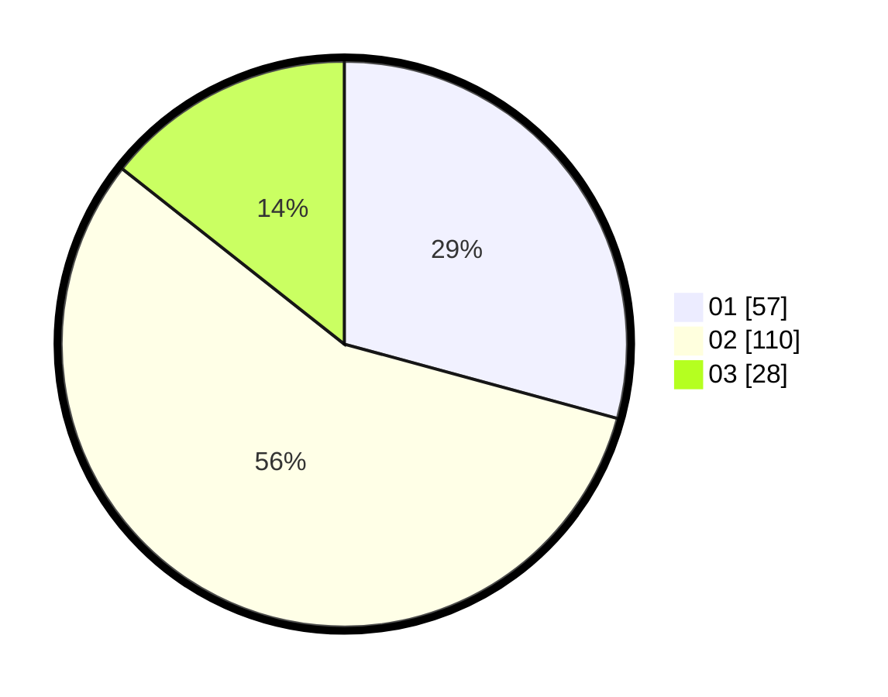

# Hasil

Hasil perolehan suara paslon dapat dilihat pada file paslon-01.txt, paslon-02.txt, dan paslon-03.txt.

Jika tidak ada, artinya data tersebut belum ada pada SIREKAP.

## Perolehan Suara

 * Paslon 01: **57**.
 * Paslon 02: **110**.
 * Paslon 03: **28**.

## Foto C Plano

https://sirekap-obj-formc.kpu.go.id/d1d3/pemilu/ppwp/31/73/01/10/05/3173011005296-20240214-192323--6258df1d-2501-416e-b8f9-fbdae85dcfae.jpg

https://sirekap-obj-formc.kpu.go.id/d1d3/pemilu/ppwp/31/73/01/10/05/3173011005296-20240214-192336--68194e24-89bb-4d79-8758-3752c19d7229.jpg

https://sirekap-obj-formc.kpu.go.id/d1d3/pemilu/ppwp/31/73/01/10/05/3173011005296-20240214-192346--902295c9-e733-469a-86d7-02be89a57b2f.jpg

## DATA PEMILIH TETAP

Jumlah pemilih dalam DPT: **255**.
 * L: **125**.
 * P: **130**.

## DATA PENGGUNA HAK PILIH

Jumlah pengguna hak pilih dalam DPT: **195**.
 * L: **90**.
 * P: **105**.

Jumlah pengguna hak pilih dalam DPTb: **0**.
 * L: **0**.
 * P: **0**.

Jumlah pengguna hak pilih dalam DPK: **0**.
 * L: **0**.
 * P: **0**.

Jumlah pengguna hak pilih: **195**.
 * L: **90**.
 * P: **105**.

## JUMLAH SUARA SAH DAN TIDAK SAH

JUMLAH SELURUH SUARA SAH: **195**.

JUMLAH SUARA TIDAK SAH: **1**.

JUMLAH SELURUH SUARA SAH DAN SUARA TIDAK SAH: **196**.
