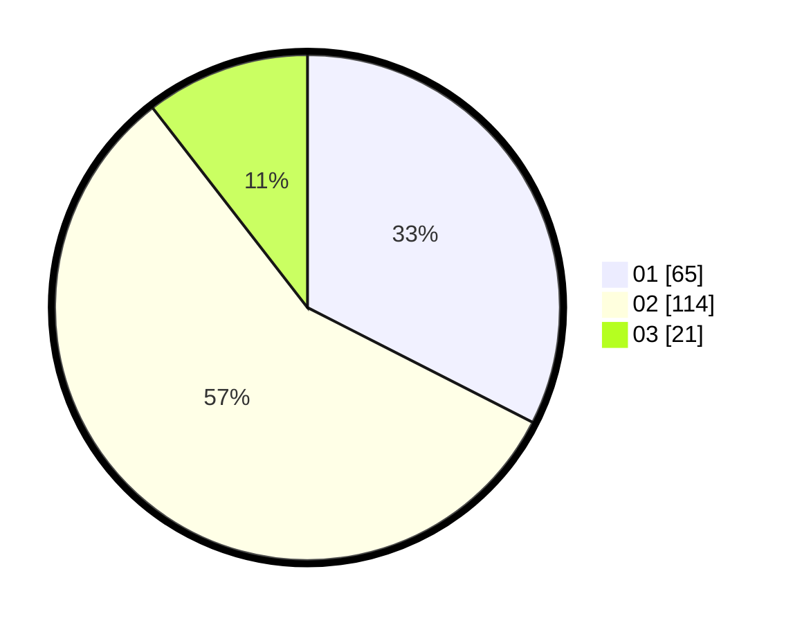

# Hasil

Hasil perolehan suara paslon dapat dilihat pada file paslon-01.txt, paslon-02.txt, dan paslon-03.txt.

Jika tidak ada, artinya data tersebut belum ada pada SIREKAP.

## Perolehan Suara

 * Paslon 01: **65**.
 * Paslon 02: **114**.
 * Paslon 03: **21**.

## Foto C Plano

https://sirekap-obj-formc.kpu.go.id/599f/pemilu/ppwp/31/73/01/10/05/3173011005297-20240214-155907--56d3f036-5199-4795-af91-cf6c9007599b.jpg

https://sirekap-obj-formc.kpu.go.id/599f/pemilu/ppwp/31/73/01/10/05/3173011005297-20240215-000922--2a80bd2b-dfa8-4822-816f-dec7fc22a6b1.jpg

https://sirekap-obj-formc.kpu.go.id/599f/pemilu/ppwp/31/73/01/10/05/3173011005297-20240214-155924--36715eb6-6947-4b62-9614-e211fd3f01b2.jpg

## DATA PEMILIH TETAP

Jumlah pemilih dalam DPT: **275**.
 * L: **148**.
 * P: **127**.

## DATA PENGGUNA HAK PILIH

Jumlah pengguna hak pilih dalam DPT: **209**.
 * L: **100**.
 * P: **109**.

Jumlah pengguna hak pilih dalam DPTb: **0**.
 * L: **0**.
 * P: **0**.

Jumlah pengguna hak pilih dalam DPK: **0**.
 * L: **0**.
 * P: **0**.

Jumlah pengguna hak pilih: **209**.
 * L: **100**.
 * P: **109**.

## JUMLAH SUARA SAH DAN TIDAK SAH

JUMLAH SELURUH SUARA SAH: **200**.

JUMLAH SUARA TIDAK SAH: **9**.

JUMLAH SELURUH SUARA SAH DAN SUARA TIDAK SAH: **209**.
