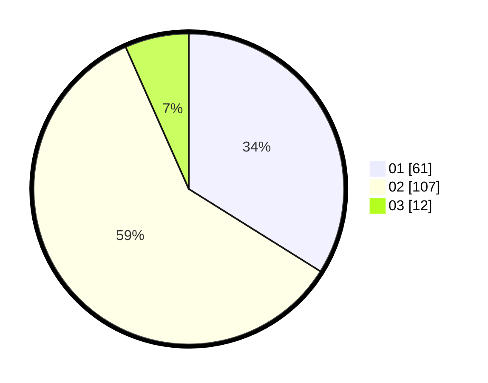

# Hasil

Hasil perolehan suara paslon dapat dilihat pada file paslon-01.txt, paslon-02.txt, dan paslon-03.txt.

Jika tidak ada, artinya data tersebut belum ada pada SIREKAP.

## Perolehan Suara

 * Paslon 01: **61**.
 * Paslon 02: **107**.
 * Paslon 03: **12**.

## Foto C Plano

https://sirekap-obj-formc.kpu.go.id/da52/pemilu/ppwp/31/73/01/10/05/3173011005300-20240214-224119--e1f1cafa-916a-428a-9007-f223bfcff4ca.jpg

https://sirekap-obj-formc.kpu.go.id/da52/pemilu/ppwp/31/73/01/10/05/3173011005300-20240214-224219--2fc89005-edd4-4318-b02d-bbc871e71a64.jpg
