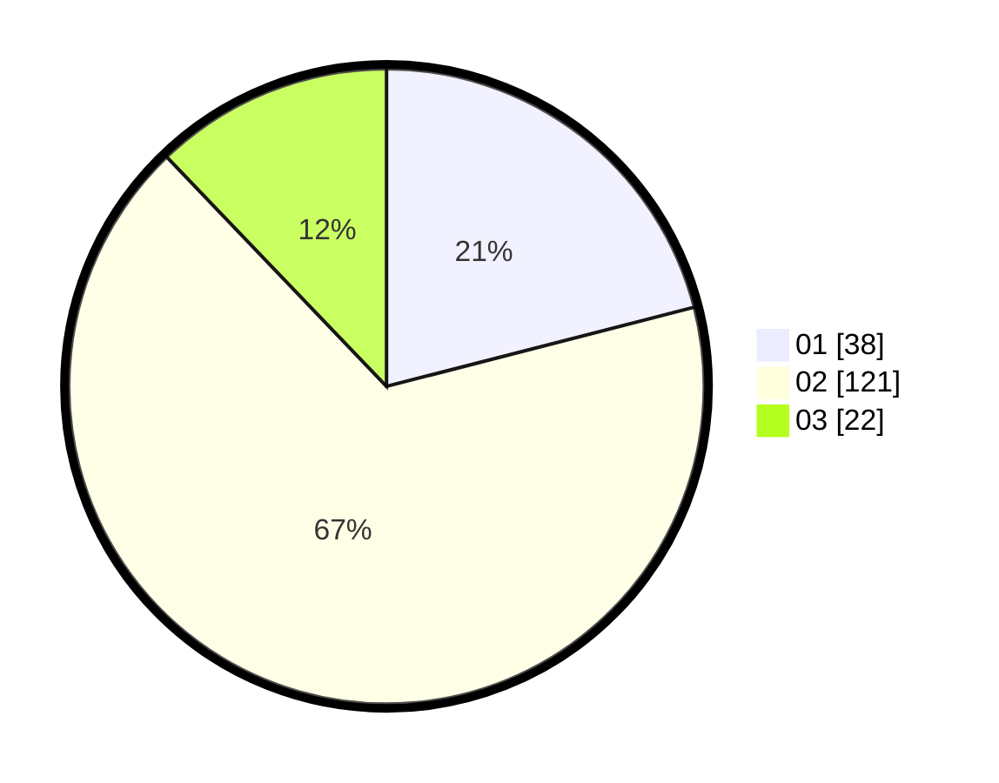

# Hasil

Hasil perolehan suara paslon dapat dilihat pada file paslon-01.txt, paslon-02.txt, dan paslon-03.txt.

Jika tidak ada, artinya data tersebut belum ada pada SIREKAP.

## Perolehan Suara

 * Paslon 01: **38**.
 * Paslon 02: **121**.
 * Paslon 03: **22**.

## Foto C Plano

https://sirekap-obj-formc.kpu.go.id/2882/pemilu/ppwp/31/73/01/10/05/3173011005305-20240216-004643--30b1fd83-a735-4d23-85d3-05339607c906.jpg

https://sirekap-obj-formc.kpu.go.id/2882/pemilu/ppwp/31/73/01/10/05/3173011005305-20240216-004649--98c49b2f-6127-4792-bedd-ef80d446cb35.jpg

https://sirekap-obj-formc.kpu.go.id/2882/pemilu/ppwp/31/73/01/10/05/3173011005305-20240216-004644--e18e8818-47db-4932-9762-f26c0badd0a8.jpg

## DATA PEMILIH TETAP

Jumlah pemilih dalam DPT: **272**.
 * L: **138**.
 * P: **134**.

## DATA PENGGUNA HAK PILIH

Jumlah pengguna hak pilih dalam DPT: **182**.
 * L: **84**.
 * P: **98**.

Jumlah pengguna hak pilih dalam DPTb: **0**.
 * L: **0**.
 * P: **0**.

Jumlah pengguna hak pilih dalam DPK: **0**.
 * L: **0**.
 * P: **0**.

Jumlah pengguna hak pilih: **182**.
 * L: **84**.
 * P: **98**.

## JUMLAH SUARA SAH DAN TIDAK SAH

JUMLAH SELURUH SUARA SAH: **181**.

JUMLAH SUARA TIDAK SAH: **1**.

JUMLAH SELURUH SUARA SAH DAN SUARA TIDAK SAH: **182**.
