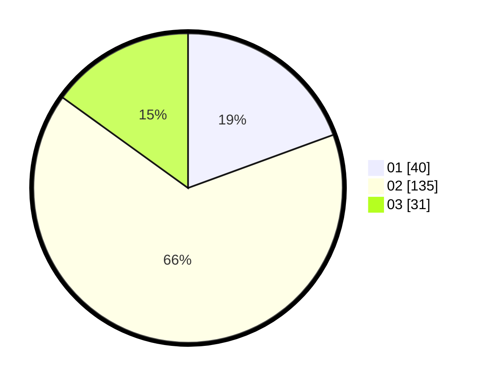

# Hasil

Hasil perolehan suara paslon dapat dilihat pada file paslon-01.txt, paslon-02.txt, dan paslon-03.txt.

Jika tidak ada, artinya data tersebut belum ada pada SIREKAP.

## Perolehan Suara

 * Paslon 01: **40**.
 * Paslon 02: **135**.
 * Paslon 03: **31**.

## Foto C Plano

https://sirekap-obj-formc.kpu.go.id/f6db/pemilu/ppwp/31/73/01/10/05/3173011005306-20240216-044956--65511dd5-0e8d-4baa-aecb-c6f24332f665.jpg

https://sirekap-obj-formc.kpu.go.id/f6db/pemilu/ppwp/31/73/01/10/05/3173011005306-20240216-045013--bb79b93f-155f-4287-825c-a41036dab579.jpg

https://sirekap-obj-formc.kpu.go.id/f6db/pemilu/ppwp/31/73/01/10/05/3173011005306-20240216-045007--be4b8c55-abe3-4762-b9d5-dc21370215e6.jpg

## DATA PEMILIH TETAP

Jumlah pemilih dalam DPT: **274**.
 * L: **141**.
 * P: **133**.

## DATA PENGGUNA HAK PILIH

Jumlah pengguna hak pilih dalam DPT: **207**.
 * L: **104**.
 * P: **103**.

Jumlah pengguna hak pilih dalam DPTb: **0**.
 * L: **0**.
 * P: **0**.

Jumlah pengguna hak pilih dalam DPK: **0**.
 * L: **0**.
 * P: **0**.

Jumlah pengguna hak pilih: **207**.
 * L: **104**.
 * P: **103**.

## JUMLAH SUARA SAH DAN TIDAK SAH

JUMLAH SELURUH SUARA SAH: **206**.

JUMLAH SUARA TIDAK SAH: **1**.

JUMLAH SELURUH SUARA SAH DAN SUARA TIDAK SAH: **207**.
